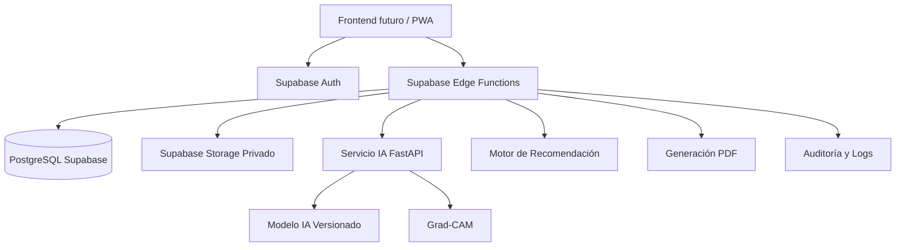
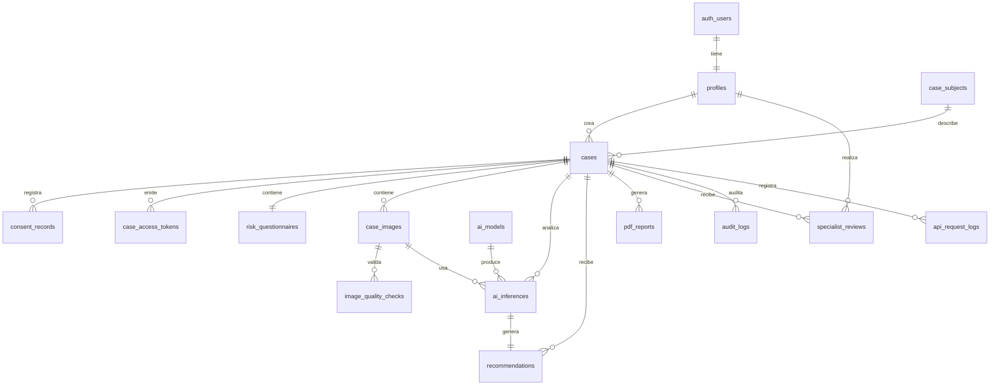
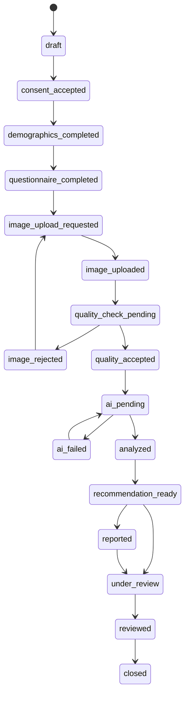

# Backend por fases — MVP OralDiagnostic en Supabase

**Documento:** Especificación técnica integral de backend y base de datos  
**Proyecto:** OralDiagnostic — Sistema inteligente de apoyo al triaje preventivo de lesiones bucales sospechosas mediante IA  
**Enfoque:** Backend, base de datos, seguridad, Storage, Edge Functions, integración IA y contratos futuros para frontend  
**Tecnología central obligatoria:** Supabase  
**Fecha:** 2026-06-30  
**Versión:** 1.0  
**Idioma:** Español técnico profesional  

---

## 0. Propósito del documento

Este documento define de forma explícita, ordenada y ejecutable el backend del MVP de **OralDiagnostic**, usando **Supabase como backend principal**.

El objetivo es que este archivo pueda ser usado posteriormente por un MCP, agente de desarrollo o equipo técnico para implementar el backend sin inventar nombres de tablas, relaciones, estados, permisos, flujos, reglas, contratos de API ni estructuras de almacenamiento.

Este documento se enfoca exclusivamente en:

1. Base de datos PostgreSQL en Supabase.
2. Supabase Auth para usuarios internos.
3. Supabase Row Level Security.
4. Supabase Storage privado.
5. Supabase Edge Functions.
6. Integración con servicio IA externo.
7. Motor de recomendación preventiva.
8. Auditoría, trazabilidad, seguridad y estándares mínimos de MVP.
9. Contratos backend para futura integración con frontend.

El frontend queda fuera del alcance de implementación de este documento. Solo se dejan contratos y decisiones necesarias para conectarlo después sin confusión.

---

## 1. Principios obligatorios del backend

### 1.1 Principio clínico obligatorio

El backend **no debe almacenar, exponer ni generar mensajes que presenten el resultado como diagnóstico médico definitivo**.

El sistema debe manejar siempre los resultados como:

- Apoyo al triaje.
- Sospecha visual.
- Orientación preventiva.
- Recomendación de derivación profesional.

No se deben usar en base de datos, APIs, reportes ni respuestas textos como:

```text
diagnóstico de cáncer
positivo para cáncer
negativo para cáncer
lesión maligna confirmada
lesión benigna confirmada
```

Sí se permite usar:

```text
baja sospecha visual
sospecha moderada
sospecha alta
imagen inválida
se recomienda evaluación profesional
el sistema no confirma ni descarta cáncer
```

### 1.2 Principio de privacidad

Las imágenes bucales son datos sensibles de salud. El backend debe aplicar minimización de datos:

- No pedir nombre completo en el MVP.
- No pedir cédula.
- No pedir teléfono.
- No pedir dirección exacta.
- No publicar imágenes.
- No permitir buckets públicos.
- No exponer la clave `service_role`.
- No entregar rutas internas sin URLs firmadas.
- No permitir lectura directa anónima de tablas sensibles.
- Registrar auditoría sin guardar IP cruda; se guarda hash.

### 1.3 Principio de seguridad por diseño

Toda operación sensible debe pasar por una de estas dos rutas:

1. **Edge Function validada**, usando `service_role` solo en servidor.
2. **RLS estricta**, para usuarios autenticados internos.

El frontend público/anónimo no debe insertar directamente en tablas sensibles ni leer datos crudos desde PostgREST.

### 1.4 Principio de escalabilidad

Supabase será el backend principal, pero el procesamiento IA pesado debe quedar desacoplado como servicio externo versionable.

Motivos:

- Las Edge Functions son ideales para orquestar, validar, proteger y persistir datos.
- La inferencia con CNN, TensorFlow/PyTorch, OpenCV y Grad-CAM puede requerir dependencias pesadas.
- Separar IA permite escalar CPU/GPU de forma independiente.
- Permite reemplazar modelos sin rediseñar base de datos ni frontend.

---

## 2. Arquitectura backend del MVP



### 2.1 Componentes usados en Supabase

| Componente Supabase | Uso en el MVP | Obligatorio |
|---|---|---:|
| PostgreSQL | Persistencia relacional, casos, cuestionarios, IA, reportes, auditoría. | Sí |
| Auth | Usuarios internos: admin, especialista, promotor, investigador. | Sí |
| Row Level Security | Protección de tablas expuestas en schema `public`. | Sí |
| Storage | Imágenes originales, Grad-CAM, reportes PDF. | Sí |
| Edge Functions | API backend del MVP. | Sí |
| Secrets | Variables sensibles: token IA, claves internas. | Sí |
| Realtime | No necesario para MVP. Puede agregarse luego para panel en vivo. | No |
| Cron/Scheduled Functions | Útil para limpieza de tokens expirados y retención. | Recomendado |
| Database Webhooks | No requerido en MVP. | No |
| Vault | Recomendado si se gestionan secretos avanzados. | Opcional |

---

## 3. Stack tecnológico backend

### 3.1 Stack principal

| Área | Tecnología | Uso |
|---|---|---|
| Backend principal | Supabase | Backend administrado principal del MVP. |
| Base de datos | PostgreSQL | Modelo relacional, integridad, restricciones, vistas y funciones. |
| Seguridad DB | Row Level Security | Autorización por rol y propiedad. |
| Autenticación | Supabase Auth | Login de usuarios internos. |
| API serverless | Supabase Edge Functions | Endpoints seguros para frontend y orquestación. |
| Runtime Edge | Deno + TypeScript | Código de Edge Functions. |
| Storage | Supabase Storage | Objetos privados: imágenes y PDFs. |
| Validación | Zod en Edge Functions | Validar payloads HTTP. |
| PDF | pdf-lib o generación en servicio auxiliar | Crear reporte PDF de derivación. |
| IA externa | FastAPI + Python | Inferencia CNN y Grad-CAM. |
| Logs | Audit tables + Supabase logs | Trazabilidad funcional y técnica. |
| Migraciones | Supabase CLI | Versionado de esquema y funciones. |

### 3.2 Servicio externo permitido

El único servicio externo considerado esencial para el MVP es:

| Servicio | Tecnología sugerida | Responsabilidad |
|---|---|---|
| Servicio IA | FastAPI + Python + TensorFlow/Keras o PyTorch | Validación avanzada de imagen, inferencia, probabilidad, Grad-CAM. |

El backend Supabase debe invocar este servicio mediante HTTP seguro desde `run-inference`.

---

## 4. Estructura recomendada del backend

```text
oraldiagnostic/
├── supabase/
│   ├── config.toml
│   ├── seed.sql
│   ├── migrations/
│   │   ├── 0001_extensiones_enums.sql
│   │   ├── 0002_tablas_base.sql
│   │   ├── 0003_indices_constraints.sql
│   │   ├── 0004_rls_helpers_policies.sql
│   │   ├── 0005_storage_buckets_policies.sql
│   │   ├── 0006_views_rpc_dashboard.sql
│   │   └── 0007_seed_reglas_modelo.sql
│   └── functions/
│       ├── _shared/
│       │   ├── cors.ts
│       │   ├── errors.ts
│       │   ├── auth.ts
│       │   ├── supabase-admin.ts
│       │   ├── validation.ts
│       │   ├── audit.ts
│       │   └── response.ts
│       ├── health-check/
│       │   └── index.ts
│       ├── create-case/
│       │   └── index.ts
│       ├── submit-questionnaire/
│       │   └── index.ts
│       ├── request-image-upload/
│       │   └── index.ts
│       ├── finalize-image-upload/
│       │   └── index.ts
│       ├── validate-image/
│       │   └── index.ts
│       ├── run-inference/
│       │   └── index.ts
│       ├── generate-report/
│       │   └── index.ts
│       ├── get-case-result/
│       │   └── index.ts
│       ├── create-signed-read-url/
│       │   └── index.ts
│       ├── review-case/
│       │   └── index.ts
│       ├── dashboard-metrics/
│       │   └── index.ts
│       ├── admin-upsert-ai-model/
│       │   └── index.ts
│       └── cleanup-expired-case-tokens/
│           └── index.ts
└── services/
    └── ai/
        ├── app/
        │   ├── main.py
        │   ├── schemas.py
        │   ├── inference.py
        │   ├── gradcam.py
        │   └── preprocessing.py
        ├── Dockerfile
        └── requirements.txt
```

---

## 5. Actores backend y roles

### 5.1 Actores

| Actor | Descripción | Acceso backend |
|---|---|---|
| Visitante anónimo | Persona que registra un caso sin login. | Solo mediante Edge Functions públicas controladas y token temporal. |
| Promotor de salud | Usuario autenticado que registra casos en campañas. | Auth + RLS + Edge Functions. |
| Especialista | Odontólogo, docente o profesional que revisa casos. | Auth + RLS + panel de revisión. |
| Administrador | Usuario responsable del sistema. | Auth + permisos administrativos. |
| Investigador | Consulta métricas agregadas anonimizadas. | Auth + vistas agregadas. |
| Servicio IA | Servicio técnico externo. | No accede directo a DB; recibe URL firmada temporal. |
| Supabase service_role | Identidad técnica del backend. | Solo en Edge Functions, nunca frontend. |

### 5.2 Roles internos

```text
admin
specialist
promoter
researcher
```

### 5.3 Matriz de permisos backend

| Recurso / Acción | Anónimo | Promotor | Especialista | Investigador | Admin |
|---|---:|---:|---:|---:|---:|
| Crear caso | Sí, por Edge Function | Sí | Sí | No | Sí |
| Aceptar consentimiento | Sí, por Edge Function | Sí | Sí | No | Sí |
| Subir imagen | Sí, por URL firmada | Sí | Sí | No | Sí |
| Leer caso propio | Sí, con token temporal | Casos creados | Casos asignados/sospechosos | No raw | Todos |
| Ejecutar IA | Sí, por flujo controlado | Sí | Sí | No | Sí |
| Ver imagen original | Temporal | Casos creados | Casos en revisión | No | Sí |
| Generar PDF | Sí, caso propio | Sí | Sí | No | Sí |
| Revisar caso | No | No | Sí | No | Sí |
| Gestionar modelos IA | No | No | No | No | Sí |
| Ver dashboard agregado | No | Limitado | Sí | Sí, anonimizado | Sí |
| Ver auditoría | No | No | Limitado | No | Sí |

---

# PARTE I — MODELO DE DATOS

## Fase 1. Diseño relacional y estándares de base de datos

### Subfase 1.1 Estándares obligatorios

La base de datos debe cumplir estos estándares:

| Estándar | Regla |
|---|---|
| Nombres | Todo en `snake_case`. |
| Idioma técnico DB | Tablas y columnas en inglés técnico para compatibilidad; comentarios SQL en español. |
| Claves primarias | UUID con `gen_random_uuid()`. |
| Fechas | `timestamptz`, siempre UTC. |
| Auditoría temporal | `created_at`, `updated_at` donde aplique. |
| Estados finitos | Usar `enum` PostgreSQL. |
| Datos flexibles | `jsonb` solo para metadata secundaria, nunca para reemplazar relaciones críticas. |
| Integridad | FK explícitas, `check`, `unique`, `not null`, índices. |
| Seguridad | RLS habilitada en todas las tablas del schema `public`. |
| Datos sensibles | Minimización y anonimización. |
| Storage | Rutas no identificables y buckets privados. |
| Migraciones | Todo debe estar versionado en `supabase/migrations`. |
| Service role | Prohibido usar en frontend. Solo Edge Functions. |
| Soft delete | Usar `deleted_at` en entidades principales cuando aplique. |
| Versionado IA | Toda inferencia debe registrar modelo y versión. |

> Nota: Se usan nombres técnicos en inglés para tablas/columnas porque es estándar en bases de datos, ORMs, APIs y generación de tipos. Todos los comentarios, documentación y reglas quedan en español.

---

## Fase 2. Entidades, atributos, relaciones y cardinalidad

### Subfase 2.1 Lista de tablas del MVP

| Tabla | Propósito | Sensible | RLS |
|---|---|---:|---:|
| `profiles` | Perfil de usuarios internos y rol. | Sí | Sí |
| `case_subjects` | Datos anónimos mínimos del sujeto. | Sí | Sí |
| `cases` | Caso principal de triaje. | Sí | Sí |
| `consent_records` | Consentimiento informado. | Sí | Sí |
| `case_access_tokens` | Tokens temporales para acceso anónimo controlado. | Sí | Sí |
| `risk_questionnaires` | Cuestionario clínico básico. | Sí | Sí |
| `case_images` | Metadata de imágenes originales y derivadas. | Sí | Sí |
| `image_quality_checks` | Resultado de validación de calidad. | Sí | Sí |
| `ai_models` | Catálogo de modelos IA. | Medio | Sí |
| `ai_inferences` | Resultados de inferencia IA. | Sí | Sí |
| `recommendations` | Recomendaciones preventivas. | Sí | Sí |
| `pdf_reports` | Metadata de reportes PDF. | Sí | Sí |
| `specialist_reviews` | Revisiones profesionales. | Sí | Sí |
| `triage_rules` | Reglas configurables del motor preventivo. | Medio | Sí |
| `audit_logs` | Auditoría funcional y seguridad. | Sí | Sí |
| `api_request_logs` | Logs técnicos de Edge Functions. | Medio | Sí |
| `system_settings` | Configuración global controlada. | Medio | Sí |

---

### Subfase 2.2 Diccionario de datos por tabla

#### Tabla: `profiles`

| Columna | Tipo | Nulo | Descripción |
|---|---|---:|---|
| `id` | `uuid` | No | PK y FK hacia `auth.users(id)`. |
| `full_name` | `text` | No | Nombre del usuario interno. |
| `role` | `app_role` | No | Rol: admin, specialist, promoter, researcher. |
| `institution` | `text` | Sí | Institución o campaña. |
| `is_active` | `boolean` | No | Controla si puede operar. |
| `created_at` | `timestamptz` | No | Fecha de creación. |
| `updated_at` | `timestamptz` | No | Fecha de actualización. |

#### Tabla: `case_subjects`

| Columna | Tipo | Nulo | Descripción |
|---|---|---:|---|
| `id` | `uuid` | No | PK del sujeto anónimo. |
| `age_years` | `smallint` | Sí | Edad aproximada entre 0 y 120. |
| `sex` | `biological_sex` | No | Sexo declarado o no especificado. |
| `city` | `text` | Sí | Ciudad general. No dirección exacta. |
| `zone` | `text` | Sí | Zona general. No ubicación precisa. |
| `created_at` | `timestamptz` | No | Fecha de creación. |
| `deleted_at` | `timestamptz` | Sí | Borrado lógico si aplica retención. |

#### Tabla: `cases`

| Columna | Tipo | Nulo | Descripción |
|---|---|---:|---|
| `id` | `uuid` | No | PK del caso. |
| `case_code` | `text` | No | Código anónimo único, ejemplo `OD-20260630-A1B2C3D4`. |
| `subject_id` | `uuid` | No | FK hacia `case_subjects`. |
| `created_by` | `uuid` | Sí | FK hacia `profiles`; nulo si fue anónimo. |
| `status` | `case_status` | No | Estado operativo del caso. |
| `lesion_site` | `lesion_site` | No | Zona bucal afectada. |
| `lesion_duration_days` | `integer` | No | Días de evolución de la lesión. |
| `final_suspicion_level` | `suspicion_level` | Sí | Resultado final consolidado. |
| `final_urgency_level` | `urgency_level` | Sí | Urgencia final consolidada. |
| `final_recommendation` | `text` | Sí | Mensaje final preventivo. |
| `clinical_disclaimer_acknowledged` | `boolean` | No | Confirma aceptación del alcance no diagnóstico. |
| `created_at` | `timestamptz` | No | Fecha de creación. |
| `updated_at` | `timestamptz` | No | Fecha de actualización. |
| `closed_at` | `timestamptz` | Sí | Fecha de cierre. |
| `deleted_at` | `timestamptz` | Sí | Borrado lógico. |

#### Tabla: `consent_records`

| Columna | Tipo | Nulo | Descripción |
|---|---|---:|---|
| `id` | `uuid` | No | PK del consentimiento. |
| `case_id` | `uuid` | No | FK hacia `cases`. |
| `accepted` | `boolean` | No | Debe ser verdadero para avanzar. |
| `consent_version` | `text` | No | Versión legal/técnica del consentimiento. |
| `accepted_at` | `timestamptz` | No | Fecha de aceptación. |
| `ip_hash` | `text` | Sí | Hash de IP, nunca IP cruda. |
| `user_agent_hash` | `text` | Sí | Hash de navegador/dispositivo. |
| `metadata` | `jsonb` | No | Metadata no sensible adicional. |

#### Tabla: `case_access_tokens`

| Columna | Tipo | Nulo | Descripción |
|---|---|---:|---|
| `id` | `uuid` | No | PK del token. |
| `case_id` | `uuid` | No | FK hacia `cases`. |
| `token_hash` | `text` | No | Hash SHA-256 del token; nunca guardar token plano. |
| `purpose` | `case_token_purpose` | No | Uso permitido del token. |
| `expires_at` | `timestamptz` | No | Fecha de expiración. |
| `used_at` | `timestamptz` | Sí | Fecha de uso si es token de un solo uso. |
| `revoked_at` | `timestamptz` | Sí | Fecha de revocación. |
| `created_at` | `timestamptz` | No | Fecha de creación. |

#### Tabla: `risk_questionnaires`

| Columna | Tipo | Nulo | Descripción |
|---|---|---:|---|
| `id` | `uuid` | No | PK del cuestionario. |
| `case_id` | `uuid` | No | FK única hacia `cases`. |
| `pain` | `boolean` | No | Dolor. |
| `bleeding` | `boolean` | No | Sangrado. |
| `growth` | `boolean` | No | Crecimiento. |
| `white_patch` | `boolean` | No | Mancha blanca. |
| `red_patch` | `boolean` | No | Mancha roja. |
| `non_healing_ulcer` | `boolean` | No | Herida/úlcera que no cicatriza. |
| `lump_or_induration` | `boolean` | No | Bulto o endurecimiento. |
| `dysphagia` | `boolean` | No | Dificultad para tragar. |
| `tobacco_use` | `boolean` | No | Consumo de tabaco. |
| `alcohol_use` | `boolean` | No | Consumo de alcohol. |
| `coca_chewing` | `boolean` | No | Masticación de hoja de coca. |
| `coca_machucada` | `boolean` | No | Coca machucada. |
| `bicarbonate_or_additives` | `boolean` | No | Uso de bicarbonato/saborizantes/aditivos. |
| `dental_prosthesis` | `boolean` | No | Prótesis dental. |
| `constant_friction` | `boolean` | No | Roce constante. |
| `notes` | `text` | Sí | Observación breve, máximo 1000 caracteres. |
| `risk_score` | `numeric(5,2)` | Sí | Puntaje interno orientativo. |
| `created_at` | `timestamptz` | No | Fecha de creación. |
| `updated_at` | `timestamptz` | No | Fecha de actualización. |

#### Tabla: `case_images`

| Columna | Tipo | Nulo | Descripción |
|---|---|---:|---|
| `id` | `uuid` | No | PK de imagen. |
| `case_id` | `uuid` | No | FK hacia `cases`. |
| `image_kind` | `image_kind` | No | Original, Grad-CAM, miniatura o imagen embebida. |
| `capture_source` | `capture_source` | Sí | Cámara o galería. |
| `bucket_name` | `text` | No | Bucket privado. |
| `object_path` | `text` | No | Ruta interna del objeto. |
| `mime_type` | `text` | No | MIME permitido. |
| `size_bytes` | `integer` | No | Tamaño en bytes. |
| `width_px` | `integer` | Sí | Ancho en píxeles. |
| `height_px` | `integer` | Sí | Alto en píxeles. |
| `sha256_hash` | `text` | Sí | Hash del archivo para trazabilidad/deduplicación. |
| `uploaded_by` | `uuid` | Sí | FK hacia `profiles`; nulo si anónimo. |
| `created_at` | `timestamptz` | No | Fecha de carga. |

#### Tabla: `image_quality_checks`

| Columna | Tipo | Nulo | Descripción |
|---|---|---:|---|
| `id` | `uuid` | No | PK de validación. |
| `image_id` | `uuid` | No | FK hacia `case_images`. |
| `status` | `image_quality_status` | No | Pendiente, aceptada, rechazada o error. |
| `sharpness_score` | `numeric(8,3)` | Sí | Nitidez calculada. |
| `brightness_score` | `numeric(8,3)` | Sí | Brillo calculado. |
| `contrast_score` | `numeric(8,3)` | Sí | Contraste calculado. |
| `resolution_ok` | `boolean` | No | Resolución mínima aprobada. |
| `focus_ok` | `boolean` | No | Enfoque suficiente. |
| `illumination_ok` | `boolean` | No | Iluminación suficiente. |
| `rejection_reasons` | `text[]` | No | Motivos de rechazo. |
| `metadata` | `jsonb` | No | Datos técnicos no estructurados. |
| `created_at` | `timestamptz` | No | Fecha de validación. |

#### Tabla: `ai_models`

| Columna | Tipo | Nulo | Descripción |
|---|---|---:|---|
| `id` | `uuid` | No | PK del modelo. |
| `name` | `text` | No | Nombre lógico del modelo. |
| `version` | `text` | No | Versión semántica del modelo. |
| `architecture` | `text` | No | Arquitectura: MobileNetV3, EfficientNet-B0, etc. |
| `storage_path` | `text` | Sí | Ruta del artefacto del modelo si aplica. |
| `input_shape` | `jsonb` | No | Forma de entrada, ejemplo `[224,224,3]`. |
| `class_labels` | `jsonb` | No | Etiquetas de clases. |
| `threshold_config` | `jsonb` | No | Umbrales de clasificación. |
| `metrics` | `jsonb` | No | Métricas técnicas validadas. |
| `is_active` | `boolean` | No | Indica si es modelo activo. |
| `created_at` | `timestamptz` | No | Fecha de registro. |

#### Tabla: `ai_inferences`

| Columna | Tipo | Nulo | Descripción |
|---|---|---:|---|
| `id` | `uuid` | No | PK de inferencia. |
| `case_id` | `uuid` | No | FK hacia `cases`. |
| `image_id` | `uuid` | No | FK hacia imagen original analizada. |
| `model_id` | `uuid` | No | FK hacia `ai_models`. |
| `suspicion_level` | `suspicion_level` | No | Nivel visual devuelto por IA. |
| `probability` | `numeric(6,5)` | No | Probabilidad principal entre 0 y 1. |
| `class_probabilities` | `jsonb` | No | Probabilidades por clase. |
| `gradcam_image_id` | `uuid` | Sí | FK hacia `case_images` de tipo Grad-CAM. |
| `latency_ms` | `integer` | Sí | Latencia de inferencia. |
| `service_request_id` | `text` | Sí | ID de correlación con servicio IA. |
| `metadata` | `jsonb` | No | Metadata técnica. |
| `created_at` | `timestamptz` | No | Fecha de inferencia. |

#### Tabla: `recommendations`

| Columna | Tipo | Nulo | Descripción |
|---|---|---:|---|
| `id` | `uuid` | No | PK de recomendación. |
| `case_id` | `uuid` | No | FK hacia `cases`. |
| `inference_id` | `uuid` | Sí | FK hacia `ai_inferences`. |
| `suspicion_level` | `suspicion_level` | No | Nivel consolidado. |
| `urgency_level` | `urgency_level` | No | Urgencia preventiva. |
| `professional_referral` | `boolean` | No | Indica si recomienda derivación. |
| `reason_codes` | `text[]` | No | Códigos de reglas aplicadas. |
| `message` | `text` | No | Mensaje preventivo mostrado al usuario. |
| `created_at` | `timestamptz` | No | Fecha de recomendación. |

#### Tabla: `pdf_reports`

| Columna | Tipo | Nulo | Descripción |
|---|---|---:|---|
| `id` | `uuid` | No | PK del reporte. |
| `case_id` | `uuid` | No | FK hacia `cases`. |
| `generated_by` | `uuid` | Sí | FK hacia `profiles`; nulo si fue flujo anónimo. |
| `bucket_name` | `text` | No | Bucket privado del PDF. |
| `object_path` | `text` | No | Ruta interna del PDF. |
| `report_hash` | `text` | Sí | Hash del PDF. |
| `report_version` | `text` | No | Versión de plantilla. |
| `created_at` | `timestamptz` | No | Fecha de generación. |

#### Tabla: `specialist_reviews`

| Columna | Tipo | Nulo | Descripción |
|---|---|---:|---|
| `id` | `uuid` | No | PK de revisión. |
| `case_id` | `uuid` | No | FK hacia `cases`. |
| `reviewed_by` | `uuid` | No | FK hacia `profiles`. |
| `decision` | `review_decision` | No | Decisión del especialista. |
| `corrected_suspicion_level` | `suspicion_level` | Sí | Corrección si aplica. |
| `clinical_notes` | `text` | No | Observación profesional. |
| `recommended_action` | `text` | Sí | Acción recomendada. |
| `created_at` | `timestamptz` | No | Fecha de revisión. |

#### Tabla: `triage_rules`

| Columna | Tipo | Nulo | Descripción |
|---|---|---:|---|
| `id` | `uuid` | No | PK de regla. |
| `code` | `text` | No | Código único de regla. |
| `description` | `text` | No | Descripción funcional. |
| `is_active` | `boolean` | No | Activa/inactiva. |
| `rule_config` | `jsonb` | No | Configuración flexible de regla. |
| `created_at` | `timestamptz` | No | Fecha de creación. |
| `updated_at` | `timestamptz` | No | Fecha de actualización. |

#### Tabla: `audit_logs`

| Columna | Tipo | Nulo | Descripción |
|---|---|---:|---|
| `id` | `uuid` | No | PK de auditoría. |
| `actor_id` | `uuid` | Sí | Usuario interno si aplica. |
| `action` | `text` | No | Acción auditada. |
| `entity_type` | `text` | No | Tipo de entidad afectada. |
| `entity_id` | `uuid` | Sí | ID de entidad afectada. |
| `case_id` | `uuid` | Sí | Caso asociado. |
| `ip_hash` | `text` | Sí | Hash de IP. |
| `user_agent_hash` | `text` | Sí | Hash de user-agent. |
| `metadata` | `jsonb` | No | Metadata segura. |
| `created_at` | `timestamptz` | No | Fecha de evento. |

#### Tabla: `api_request_logs`

| Columna | Tipo | Nulo | Descripción |
|---|---|---:|---|
| `id` | `uuid` | No | PK de log técnico. |
| `request_id` | `text` | No | ID de correlación. |
| `function_name` | `text` | No | Edge Function invocada. |
| `method` | `text` | No | Método HTTP. |
| `status_code` | `integer` | Sí | Código HTTP devuelto. |
| `actor_id` | `uuid` | Sí | Usuario interno si aplica. |
| `case_id` | `uuid` | Sí | Caso asociado si aplica. |
| `duration_ms` | `integer` | Sí | Duración total. |
| `error_code` | `text` | Sí | Código de error normalizado. |
| `metadata` | `jsonb` | No | Metadata técnica. |
| `created_at` | `timestamptz` | No | Fecha del request. |

#### Tabla: `system_settings`

| Columna | Tipo | Nulo | Descripción |
|---|---|---:|---|
| `key` | `text` | No | PK de configuración. |
| `value` | `jsonb` | No | Valor de configuración. |
| `description` | `text` | Sí | Explicación. |
| `is_public` | `boolean` | No | Si puede ser leído por cliente autenticado. |
| `updated_by` | `uuid` | Sí | Admin que modificó. |
| `updated_at` | `timestamptz` | No | Fecha de actualización. |

---

### Subfase 2.3 Relaciones y cardinalidad

| Relación | Cardinalidad | Implementación | Descripción |
|---|---|---|---|
| `auth.users` → `profiles` | 1..1 | `profiles.id` FK a `auth.users.id` | Cada usuario interno tiene un perfil. |
| `profiles` → `cases` | 1..N | `cases.created_by` | Un usuario interno puede crear muchos casos. |
| `case_subjects` → `cases` | 1..N | `cases.subject_id` | Un sujeto anónimo puede tener uno o más casos. En MVP normalmente será 1. |
| `cases` → `consent_records` | 1..N | `consent_records.case_id` | Un caso puede registrar versiones de consentimiento. |
| `cases` → `case_access_tokens` | 1..N | `case_access_tokens.case_id` | Un caso puede tener tokens temporales para resultado, upload o PDF. |
| `cases` → `risk_questionnaires` | 1..1 | `risk_questionnaires.case_id unique` | Un caso tiene un cuestionario principal. |
| `cases` → `case_images` | 1..N | `case_images.case_id` | Un caso puede tener imagen original, recapturas y Grad-CAM. |
| `case_images` → `image_quality_checks` | 1..N | `image_quality_checks.image_id` | Una imagen puede tener varias validaciones. |
| `ai_models` → `ai_inferences` | 1..N | `ai_inferences.model_id` | Un modelo genera muchas inferencias. |
| `cases` → `ai_inferences` | 1..N | `ai_inferences.case_id` | Un caso puede reanalizarse con otro modelo o imagen. |
| `case_images` → `ai_inferences` | 1..N | `ai_inferences.image_id` | Una imagen puede analizarse varias veces. |
| `ai_inferences` → `recommendations` | 1..1 lógico | `recommendations.inference_id` | Una inferencia genera una recomendación principal. |
| `cases` → `recommendations` | 1..N | `recommendations.case_id` | Un caso puede tener recomendaciones regeneradas. |
| `cases` → `pdf_reports` | 1..N | `pdf_reports.case_id` | Un caso puede tener reportes regenerados. |
| `cases` → `specialist_reviews` | 1..N | `specialist_reviews.case_id` | Un caso puede recibir una o más revisiones. |
| `profiles` → `specialist_reviews` | 1..N | `specialist_reviews.reviewed_by` | Un especialista puede revisar muchos casos. |
| `cases` → `audit_logs` | 1..N | `audit_logs.case_id` | Un caso tiene muchas acciones auditadas. |
| `cases` → `api_request_logs` | 1..N | `api_request_logs.case_id` | Un caso puede aparecer en varios requests. |

### Subfase 2.4 Diagrama ERD



---

# PARTE II — MIGRACIONES SQL

## Fase 3. Migración inicial de base de datos

### Subfase 3.1 Migración `0001_extensiones_enums.sql`

```sql
-- ============================================================
-- MIGRACIÓN: 0001_extensiones_enums.sql
-- Proyecto: OralDiagnostic
-- Propósito: Crear extensiones y tipos enumerados controlados.
-- ============================================================

-- Extensión para UUID y funciones criptográficas.
create extension if not exists pgcrypto;

-- Rol interno de usuarios autenticados.
create type public.app_role as enum (
  'admin',
  'specialist',
  'promoter',
  'researcher'
);

comment on type public.app_role is
'Roles internos del sistema OralDiagnostic. No incluye visitante anónimo.';

-- Sexo biológico/declarado con opción de no especificar.
create type public.biological_sex as enum (
  'female',
  'male',
  'other',
  'not_specified'
);

comment on type public.biological_sex is
'Sexo declarado de forma general y no identificable.';

-- Estado operativo del caso.
create type public.case_status as enum (
  'draft',
  'consent_accepted',
  'demographics_completed',
  'questionnaire_completed',
  'image_upload_requested',
  'image_uploaded',
  'quality_check_pending',
  'image_rejected',
  'quality_accepted',
  'ai_pending',
  'ai_failed',
  'analyzed',
  'recommendation_ready',
  'reported',
  'under_review',
  'reviewed',
  'closed',
  'failed'
);

comment on type public.case_status is
'Estado del flujo backend del caso de triaje.';

-- Zona bucal afectada.
create type public.lesion_site as enum (
  'lip',
  'tongue',
  'gum',
  'palate',
  'floor_of_mouth',
  'cheek_mucosa',
  'other',
  'not_specified'
);

comment on type public.lesion_site is
'Zona anatómica bucal reportada para el caso.';

-- Fuente de captura de imagen.
create type public.capture_source as enum (
  'camera',
  'gallery'
);

comment on type public.capture_source is
'Origen de la imagen cargada por el usuario.';

-- Tipo de imagen almacenada.
create type public.image_kind as enum (
  'original',
  'gradcam',
  'thumbnail',
  'report_embedded'
);

comment on type public.image_kind is
'Clasificación del objeto de imagen almacenado en Storage.';

-- Estado de calidad de imagen.
create type public.image_quality_status as enum (
  'pending',
  'accepted',
  'rejected',
  'error'
);

comment on type public.image_quality_status is
'Resultado de validación técnica de imagen.';

-- Nivel de sospecha visual.
create type public.suspicion_level as enum (
  'invalid_image',
  'low',
  'moderate',
  'high'
);

comment on type public.suspicion_level is
'Nivel de sospecha visual usado como apoyo al triaje. No representa diagnóstico médico.';

-- Nivel de urgencia preventiva.
create type public.urgency_level as enum (
  'none',
  'routine',
  'priority',
  'urgent'
);

comment on type public.urgency_level is
'Nivel de urgencia preventiva para recomendación de derivación.';

-- Decisión de revisión profesional.
create type public.review_decision as enum (
  'confirm_ai',
  'correct_ai',
  'needs_clinical_evaluation',
  'insufficient_information'
);

comment on type public.review_decision is
'Decisión registrada por especialista durante revisión del caso.';

-- Propósito de token temporal.
create type public.case_token_purpose as enum (
  'case_result_access',
  'image_upload',
  'report_download'
);

comment on type public.case_token_purpose is
'Propósito controlado para tokens temporales asociados a casos anónimos.';
```

---

### Subfase 3.2 Migración `0002_tablas_base.sql`

```sql
-- ============================================================
-- MIGRACIÓN: 0002_tablas_base.sql
-- Proyecto: OralDiagnostic
-- Propósito: Crear tablas principales del backend MVP.
-- ============================================================

create table public.profiles (
  id uuid primary key references auth.users(id) on delete cascade,
  full_name text not null check (char_length(full_name) between 2 and 160),
  role public.app_role not null default 'promoter',
  institution text check (institution is null or char_length(institution) <= 160),
  is_active boolean not null default true,
  created_at timestamptz not null default now(),
  updated_at timestamptz not null default now()
);

comment on table public.profiles is
'Perfiles de usuarios internos vinculados a Supabase Auth.';
comment on column public.profiles.id is
'Identificador del usuario. Referencia a auth.users(id).';
comment on column public.profiles.role is
'Rol interno usado por RLS y Edge Functions.';

create table public.case_subjects (
  id uuid primary key default gen_random_uuid(),
  age_years smallint check (age_years is null or age_years between 0 and 120),
  sex public.biological_sex not null default 'not_specified',
  city text check (city is null or char_length(city) <= 120),
  zone text check (zone is null or char_length(zone) <= 120),
  created_at timestamptz not null default now(),
  deleted_at timestamptz
);

comment on table public.case_subjects is
'Datos mínimos y anónimos del sujeto asociado al caso. No almacenar nombre, documento, teléfono ni dirección exacta.';

create table public.cases (
  id uuid primary key default gen_random_uuid(),
  case_code text not null unique,
  subject_id uuid not null references public.case_subjects(id) on delete restrict,
  created_by uuid references public.profiles(id) on delete set null,
  status public.case_status not null default 'draft',
  lesion_site public.lesion_site not null default 'not_specified',
  lesion_duration_days integer not null check (lesion_duration_days between 0 and 3650),
  final_suspicion_level public.suspicion_level,
  final_urgency_level public.urgency_level,
  final_recommendation text check (final_recommendation is null or char_length(final_recommendation) <= 3000),
  clinical_disclaimer_acknowledged boolean not null default false,
  created_at timestamptz not null default now(),
  updated_at timestamptz not null default now(),
  closed_at timestamptz,
  deleted_at timestamptz,
  constraint cases_final_level_consistency check (
    (final_suspicion_level is null and final_urgency_level is null)
    or
    (final_suspicion_level is not null and final_urgency_level is not null)
  )
);

comment on table public.cases is
'Caso principal de triaje preventivo. No representa diagnóstico médico.';
comment on column public.cases.case_code is
'Código anónimo visible para usuario, sin datos identificables.';
comment on column public.cases.final_recommendation is
'Mensaje preventivo final. Debe evitar lenguaje diagnóstico.';

create table public.consent_records (
  id uuid primary key default gen_random_uuid(),
  case_id uuid not null references public.cases(id) on delete cascade,
  accepted boolean not null,
  consent_version text not null check (char_length(consent_version) <= 80),
  accepted_at timestamptz not null default now(),
  ip_hash text,
  user_agent_hash text,
  metadata jsonb not null default '{}'::jsonb,
  constraint consent_must_be_true_for_mvp check (accepted = true)
);

comment on table public.consent_records is
'Registro de consentimiento informado aceptado por el usuario.';

create table public.case_access_tokens (
  id uuid primary key default gen_random_uuid(),
  case_id uuid not null references public.cases(id) on delete cascade,
  token_hash text not null unique,
  purpose public.case_token_purpose not null,
  expires_at timestamptz not null,
  used_at timestamptz,
  revoked_at timestamptz,
  created_at timestamptz not null default now(),
  constraint token_expiration_future check (expires_at > created_at)
);

comment on table public.case_access_tokens is
'Tokens temporales hasheados para permitir acceso anónimo controlado al caso, resultado o PDF. Nunca guardar token plano.';

create table public.risk_questionnaires (
  id uuid primary key default gen_random_uuid(),
  case_id uuid not null unique references public.cases(id) on delete cascade,
  pain boolean not null default false,
  bleeding boolean not null default false,
  growth boolean not null default false,
  white_patch boolean not null default false,
  red_patch boolean not null default false,
  non_healing_ulcer boolean not null default false,
  lump_or_induration boolean not null default false,
  dysphagia boolean not null default false,
  tobacco_use boolean not null default false,
  alcohol_use boolean not null default false,
  coca_chewing boolean not null default false,
  coca_machucada boolean not null default false,
  bicarbonate_or_additives boolean not null default false,
  dental_prosthesis boolean not null default false,
  constant_friction boolean not null default false,
  notes text check (notes is null or char_length(notes) <= 1000),
  risk_score numeric(5,2),
  created_at timestamptz not null default now(),
  updated_at timestamptz not null default now(),
  constraint risk_score_range check (risk_score is null or (risk_score >= 0 and risk_score <= 100))
);

comment on table public.risk_questionnaires is
'Cuestionario clínico básico de riesgo. Sirve para triaje preventivo, no para diagnóstico.';

create table public.case_images (
  id uuid primary key default gen_random_uuid(),
  case_id uuid not null references public.cases(id) on delete cascade,
  image_kind public.image_kind not null default 'original',
  capture_source public.capture_source,
  bucket_name text not null check (char_length(bucket_name) <= 80),
  object_path text not null check (char_length(object_path) <= 500),
  mime_type text not null check (mime_type in ('image/jpeg', 'image/png', 'image/webp', 'application/pdf')),
  size_bytes integer not null check (size_bytes > 0 and size_bytes <= 10485760),
  width_px integer check (width_px is null or width_px > 0),
  height_px integer check (height_px is null or height_px > 0),
  sha256_hash text check (sha256_hash is null or char_length(sha256_hash) = 64),
  uploaded_by uuid references public.profiles(id) on delete set null,
  created_at timestamptz not null default now(),
  unique(bucket_name, object_path)
);

comment on table public.case_images is
'Metadata de objetos almacenados en Supabase Storage: imagen original, Grad-CAM, miniaturas o recursos derivados.';

create table public.image_quality_checks (
  id uuid primary key default gen_random_uuid(),
  image_id uuid not null references public.case_images(id) on delete cascade,
  status public.image_quality_status not null,
  sharpness_score numeric(8,3),
  brightness_score numeric(8,3),
  contrast_score numeric(8,3),
  resolution_ok boolean not null default false,
  focus_ok boolean not null default false,
  illumination_ok boolean not null default false,
  rejection_reasons text[] not null default '{}',
  metadata jsonb not null default '{}'::jsonb,
  created_at timestamptz not null default now()
);

comment on table public.image_quality_checks is
'Validaciones técnicas de calidad de imagen antes de ejecutar IA.';

create table public.ai_models (
  id uuid primary key default gen_random_uuid(),
  name text not null check (char_length(name) <= 120),
  version text not null check (char_length(version) <= 40),
  architecture text not null check (char_length(architecture) <= 120),
  storage_path text check (storage_path is null or char_length(storage_path) <= 500),
  input_shape jsonb not null,
  class_labels jsonb not null,
  threshold_config jsonb not null,
  metrics jsonb not null default '{}'::jsonb,
  is_active boolean not null default false,
  created_at timestamptz not null default now(),
  unique(name, version)
);

comment on table public.ai_models is
'Catálogo de modelos IA versionados. Toda inferencia debe referenciar un modelo.';

create table public.ai_inferences (
  id uuid primary key default gen_random_uuid(),
  case_id uuid not null references public.cases(id) on delete cascade,
  image_id uuid not null references public.case_images(id) on delete restrict,
  model_id uuid not null references public.ai_models(id) on delete restrict,
  suspicion_level public.suspicion_level not null,
  probability numeric(6,5) not null check (probability >= 0 and probability <= 1),
  class_probabilities jsonb not null,
  gradcam_image_id uuid references public.case_images(id) on delete set null,
  latency_ms integer check (latency_ms is null or latency_ms >= 0),
  service_request_id text check (service_request_id is null or char_length(service_request_id) <= 120),
  metadata jsonb not null default '{}'::jsonb,
  created_at timestamptz not null default now()
);

comment on table public.ai_inferences is
'Resultado de inferencia IA. Es apoyo al triaje, no diagnóstico médico.';

create table public.recommendations (
  id uuid primary key default gen_random_uuid(),
  case_id uuid not null references public.cases(id) on delete cascade,
  inference_id uuid references public.ai_inferences(id) on delete set null,
  suspicion_level public.suspicion_level not null,
  urgency_level public.urgency_level not null,
  professional_referral boolean not null default false,
  reason_codes text[] not null default '{}',
  message text not null check (char_length(message) <= 3000),
  created_at timestamptz not null default now()
);

comment on table public.recommendations is
'Recomendación preventiva generada combinando IA, cuestionario y reglas conservadoras.';

create table public.pdf_reports (
  id uuid primary key default gen_random_uuid(),
  case_id uuid not null references public.cases(id) on delete cascade,
  generated_by uuid references public.profiles(id) on delete set null,
  bucket_name text not null check (char_length(bucket_name) <= 80),
  object_path text not null check (char_length(object_path) <= 500),
  report_hash text check (report_hash is null or char_length(report_hash) = 64),
  report_version text not null default 'mvp-v1' check (char_length(report_version) <= 80),
  created_at timestamptz not null default now(),
  unique(bucket_name, object_path)
);

comment on table public.pdf_reports is
'Metadata de reportes PDF privados de derivación preventiva.';

create table public.specialist_reviews (
  id uuid primary key default gen_random_uuid(),
  case_id uuid not null references public.cases(id) on delete cascade,
  reviewed_by uuid not null references public.profiles(id) on delete restrict,
  decision public.review_decision not null,
  corrected_suspicion_level public.suspicion_level,
  clinical_notes text not null check (char_length(clinical_notes) <= 5000),
  recommended_action text check (recommended_action is null or char_length(recommended_action) <= 2000),
  created_at timestamptz not null default now()
);

comment on table public.specialist_reviews is
'Revisión profesional del caso. No reemplaza historia clínica ni diagnóstico definitivo.';

create table public.triage_rules (
  id uuid primary key default gen_random_uuid(),
  code text not null unique check (char_length(code) <= 80),
  description text not null check (char_length(description) <= 1000),
  is_active boolean not null default true,
  rule_config jsonb not null,
  created_at timestamptz not null default now(),
  updated_at timestamptz not null default now()
);

comment on table public.triage_rules is
'Reglas configurables del motor de recomendación preventiva.';

create table public.audit_logs (
  id uuid primary key default gen_random_uuid(),
  actor_id uuid references public.profiles(id) on delete set null,
  action text not null check (char_length(action) <= 120),
  entity_type text not null check (char_length(entity_type) <= 120),
  entity_id uuid,
  case_id uuid references public.cases(id) on delete set null,
  ip_hash text,
  user_agent_hash text,
  metadata jsonb not null default '{}'::jsonb,
  created_at timestamptz not null default now()
);

comment on table public.audit_logs is
'Auditoría funcional de acciones críticas. No almacenar IP cruda ni datos innecesarios.';

create table public.api_request_logs (
  id uuid primary key default gen_random_uuid(),
  request_id text not null,
  function_name text not null check (char_length(function_name) <= 120),
  method text not null check (method in ('GET', 'POST', 'PUT', 'PATCH', 'DELETE', 'OPTIONS')),
  status_code integer check (status_code is null or status_code between 100 and 599),
  actor_id uuid references public.profiles(id) on delete set null,
  case_id uuid references public.cases(id) on delete set null,
  duration_ms integer check (duration_ms is null or duration_ms >= 0),
  error_code text check (error_code is null or char_length(error_code) <= 120),
  metadata jsonb not null default '{}'::jsonb,
  created_at timestamptz not null default now()
);

comment on table public.api_request_logs is
'Logs técnicos de Edge Functions para observabilidad y depuración.';

create table public.system_settings (
  key text primary key check (char_length(key) <= 120),
  value jsonb not null,
  description text,
  is_public boolean not null default false,
  updated_by uuid references public.profiles(id) on delete set null,
  updated_at timestamptz not null default now()
);

comment on table public.system_settings is
'Configuraciones globales controladas por administradores.';
```

---

### Subfase 3.3 Migración `0003_indices_constraints.sql`

```sql
-- ============================================================
-- MIGRACIÓN: 0003_indices_constraints.sql
-- Proyecto: OralDiagnostic
-- Propósito: Índices, constraints adicionales y triggers de actualización.
-- ============================================================

-- Índices para casos.
create index idx_cases_status_created_at
on public.cases(status, created_at desc)
where deleted_at is null;

create index idx_cases_created_by_created_at
on public.cases(created_by, created_at desc)
where deleted_at is null;

create index idx_cases_subject_id
on public.cases(subject_id);

create index idx_cases_case_code
on public.cases(case_code);

-- Índices para sujetos.
create index idx_case_subjects_city
on public.case_subjects(city);

-- Índices para tokens.
create index idx_case_access_tokens_case_purpose
on public.case_access_tokens(case_id, purpose, expires_at desc);

create index idx_case_access_tokens_active
on public.case_access_tokens(case_id, purpose)
where used_at is null and revoked_at is null;

-- Índices para imágenes.
create index idx_case_images_case_kind
on public.case_images(case_id, image_kind, created_at desc);

create index idx_case_images_hash
on public.case_images(sha256_hash)
where sha256_hash is not null;

-- Índices para calidad.
create index idx_quality_image_created_at
on public.image_quality_checks(image_id, created_at desc);

create index idx_quality_status_created_at
on public.image_quality_checks(status, created_at desc);

-- Índices para IA.
create index idx_ai_models_active
on public.ai_models(is_active)
where is_active = true;

create index idx_ai_inferences_case_created_at
on public.ai_inferences(case_id, created_at desc);

create index idx_ai_inferences_image_created_at
on public.ai_inferences(image_id, created_at desc);

create index idx_ai_inferences_model_created_at
on public.ai_inferences(model_id, created_at desc);

-- Índices para recomendaciones.
create index idx_recommendations_case_created_at
on public.recommendations(case_id, created_at desc);

create index idx_recommendations_levels
on public.recommendations(suspicion_level, urgency_level, created_at desc);

-- Índices para reportes.
create index idx_pdf_reports_case_created_at
on public.pdf_reports(case_id, created_at desc);

-- Índices para revisiones.
create index idx_specialist_reviews_case_created_at
on public.specialist_reviews(case_id, created_at desc);

create index idx_specialist_reviews_reviewed_by
on public.specialist_reviews(reviewed_by, created_at desc);

-- Índices para auditoría y logs.
create index idx_audit_logs_case_created_at
on public.audit_logs(case_id, created_at desc);

create index idx_audit_logs_actor_created_at
on public.audit_logs(actor_id, created_at desc);

create index idx_audit_logs_action_created_at
on public.audit_logs(action, created_at desc);

create index idx_api_request_logs_request_id
on public.api_request_logs(request_id);

create index idx_api_request_logs_function_created_at
on public.api_request_logs(function_name, created_at desc);

-- Función genérica para updated_at.
create or replace function public.set_updated_at()
returns trigger
language plpgsql
as $$
begin
  new.updated_at = now();
  return new;
end;
$$;

comment on function public.set_updated_at() is
'Actualiza automáticamente la columna updated_at antes de cada update.';

create trigger profiles_set_updated_at
before update on public.profiles
for each row execute function public.set_updated_at();

create trigger cases_set_updated_at
before update on public.cases
for each row execute function public.set_updated_at();

create trigger risk_questionnaires_set_updated_at
before update on public.risk_questionnaires
for each row execute function public.set_updated_at();

create trigger triage_rules_set_updated_at
before update on public.triage_rules
for each row execute function public.set_updated_at();

-- Garantizar que solo exista un modelo activo por nombre lógico.
create unique index uq_ai_models_one_active_per_name
on public.ai_models(name)
where is_active = true;
```

---

# PARTE III — SEGURIDAD, RLS Y FUNCIONES SQL

## Fase 4. Seguridad con RLS

### Subfase 4.1 Activación obligatoria de RLS

```sql
-- ============================================================
-- MIGRACIÓN: 0004_rls_helpers_policies.sql
-- Parte 1: Activación RLS.
-- ============================================================

alter table public.profiles enable row level security;
alter table public.case_subjects enable row level security;
alter table public.cases enable row level security;
alter table public.consent_records enable row level security;
alter table public.case_access_tokens enable row level security;
alter table public.risk_questionnaires enable row level security;
alter table public.case_images enable row level security;
alter table public.image_quality_checks enable row level security;
alter table public.ai_models enable row level security;
alter table public.ai_inferences enable row level security;
alter table public.recommendations enable row level security;
alter table public.pdf_reports enable row level security;
alter table public.specialist_reviews enable row level security;
alter table public.triage_rules enable row level security;
alter table public.audit_logs enable row level security;
alter table public.api_request_logs enable row level security;
alter table public.system_settings enable row level security;
```

### Subfase 4.2 Funciones helper de autorización

```sql
-- ============================================================
-- MIGRACIÓN: 0004_rls_helpers_policies.sql
-- Parte 2: Helpers de seguridad.
-- ============================================================

create or replace function public.current_user_role()
returns public.app_role
language sql
security definer
set search_path = public
stable
as $$
  select p.role
  from public.profiles p
  where p.id = auth.uid()
    and p.is_active = true;
$$;

comment on function public.current_user_role() is
'Devuelve el rol del usuario autenticado activo.';

create or replace function public.is_admin()
returns boolean
language sql
security definer
set search_path = public
stable
as $$
  select public.current_user_role() = 'admin';
$$;

create or replace function public.is_specialist_or_admin()
returns boolean
language sql
security definer
set search_path = public
stable
as $$
  select public.current_user_role() in ('specialist', 'admin');
$$;

create or replace function public.is_promoter_specialist_or_admin()
returns boolean
language sql
security definer
set search_path = public
stable
as $$
  select public.current_user_role() in ('promoter', 'specialist', 'admin');
$$;

create or replace function public.user_can_read_case(target_case_id uuid)
returns boolean
language sql
security definer
set search_path = public
stable
as $$
  select exists (
    select 1
    from public.cases c
    where c.id = target_case_id
      and c.deleted_at is null
      and (
        c.created_by = auth.uid()
        or public.current_user_role() in ('admin', 'specialist')
      )
  );
$$;

comment on function public.user_can_read_case(uuid) is
'Determina si el usuario autenticado puede leer un caso. No aplica para acceso anónimo con token.';

create or replace function public.user_can_review_case(target_case_id uuid)
returns boolean
language sql
security definer
set search_path = public
stable
as $$
  select exists (
    select 1
    from public.cases c
    where c.id = target_case_id
      and c.deleted_at is null
      and public.current_user_role() in ('admin', 'specialist')
      and c.status in ('analyzed', 'recommendation_ready', 'reported', 'under_review', 'reviewed')
  );
$$;

comment on function public.user_can_review_case(uuid) is
'Determina si el usuario autenticado puede revisar un caso.';
```

### Subfase 4.3 Políticas RLS mínimas

> Decisión de seguridad: Las escrituras principales del flujo se harán por Edge Functions usando `service_role`. Las políticas RLS habilitan lectura segura para usuarios internos y administración controlada. El visitante anónimo nunca accede directamente a tablas.

```sql
-- ============================================================
-- MIGRACIÓN: 0004_rls_helpers_policies.sql
-- Parte 3: Políticas RLS.
-- ============================================================

-- PROFILES
create policy "profiles_select_own_or_admin"
on public.profiles
for select
to authenticated
using (
  id = auth.uid()
  or public.is_admin()
);

create policy "profiles_update_own_limited_or_admin"
on public.profiles
for update
to authenticated
using (
  id = auth.uid()
  or public.is_admin()
)
with check (
  id = auth.uid()
  or public.is_admin()
);

-- CASE SUBJECTS
create policy "case_subjects_select_by_case_access"
on public.case_subjects
for select
to authenticated
using (
  exists (
    select 1
    from public.cases c
    where c.subject_id = case_subjects.id
      and public.user_can_read_case(c.id)
  )
);

-- CASES
create policy "cases_select_by_role_or_owner"
on public.cases
for select
to authenticated
using (
  deleted_at is null
  and (
    created_by = auth.uid()
    or public.current_user_role() in ('admin', 'specialist')
  )
);

create policy "cases_update_by_specialist_or_admin_or_owner_promoter"
on public.cases
for update
to authenticated
using (
  deleted_at is null
  and (
    public.current_user_role() in ('admin', 'specialist')
    or created_by = auth.uid()
  )
)
with check (
  deleted_at is null
  and (
    public.current_user_role() in ('admin', 'specialist')
    or created_by = auth.uid()
  )
);

-- CONSENT RECORDS
create policy "consent_records_select_by_case_access"
on public.consent_records
for select
to authenticated
using (
  public.user_can_read_case(case_id)
);

-- CASE ACCESS TOKENS
create policy "case_access_tokens_select_admin_only"
on public.case_access_tokens
for select
to authenticated
using (
  public.is_admin()
);

-- RISK QUESTIONNAIRES
create policy "risk_questionnaires_select_by_case_access"
on public.risk_questionnaires
for select
to authenticated
using (
  public.user_can_read_case(case_id)
);

-- CASE IMAGES
create policy "case_images_select_by_case_access"
on public.case_images
for select
to authenticated
using (
  public.user_can_read_case(case_id)
);

-- IMAGE QUALITY CHECKS
create policy "image_quality_select_by_case_access"
on public.image_quality_checks
for select
to authenticated
using (
  exists (
    select 1
    from public.case_images ci
    where ci.id = image_quality_checks.image_id
      and public.user_can_read_case(ci.case_id)
  )
);

-- AI MODELS
create policy "ai_models_select_authenticated"
on public.ai_models
for select
to authenticated
using (true);

create policy "ai_models_admin_all"
on public.ai_models
for all
to authenticated
using (public.is_admin())
with check (public.is_admin());

-- AI INFERENCES
create policy "ai_inferences_select_by_case_access"
on public.ai_inferences
for select
to authenticated
using (
  public.user_can_read_case(case_id)
);

-- RECOMMENDATIONS
create policy "recommendations_select_by_case_access"
on public.recommendations
for select
to authenticated
using (
  public.user_can_read_case(case_id)
);

-- PDF REPORTS
create policy "pdf_reports_select_by_case_access"
on public.pdf_reports
for select
to authenticated
using (
  public.user_can_read_case(case_id)
);

-- SPECIALIST REVIEWS
create policy "specialist_reviews_select_specialist_admin"
on public.specialist_reviews
for select
to authenticated
using (
  public.current_user_role() in ('admin', 'specialist')
);

create policy "specialist_reviews_insert_specialist_admin"
on public.specialist_reviews
for insert
to authenticated
with check (
  public.current_user_role() in ('admin', 'specialist')
  and reviewed_by = auth.uid()
);

-- TRIAGE RULES
create policy "triage_rules_select_authenticated"
on public.triage_rules
for select
to authenticated
using (true);

create policy "triage_rules_admin_all"
on public.triage_rules
for all
to authenticated
using (public.is_admin())
with check (public.is_admin());

-- AUDIT LOGS
create policy "audit_logs_select_admin"
on public.audit_logs
for select
to authenticated
using (
  public.is_admin()
);

-- API REQUEST LOGS
create policy "api_request_logs_select_admin"
on public.api_request_logs
for select
to authenticated
using (
  public.is_admin()
);

-- SYSTEM SETTINGS
create policy "system_settings_select_public_or_admin"
on public.system_settings
for select
to authenticated
using (
  is_public = true
  or public.is_admin()
);

create policy "system_settings_admin_all"
on public.system_settings
for all
to authenticated
using (public.is_admin())
with check (public.is_admin());
```

### Subfase 4.4 Restricciones de acceso anónimo

El acceso anónimo debe funcionar únicamente así:

1. `create-case` crea caso y devuelve `case_code` + `case_token` temporal en texto plano una sola vez.
2. La tabla `case_access_tokens` guarda solo `token_hash`.
3. El frontend guarda temporalmente ese token en memoria o storage seguro del navegador.
4. Para consultar resultado o descargar reporte, el frontend envía `case_code + case_token`.
5. La Edge Function hashea el token recibido y valida:
   - `case_id`.
   - `purpose`.
   - `expires_at`.
   - `revoked_at is null`.
   - Si corresponde, `used_at is null`.

---

# PARTE IV — SUPABASE STORAGE

## Fase 5. Storage privado

### Subfase 5.1 Buckets obligatorios

| Bucket | Público | Contenido | Tamaño máximo sugerido |
|---|---:|---|---:|
| `case-originals` | No | Imágenes originales del usuario. | 10 MB |
| `case-gradcam` | No | Mapas Grad-CAM generados por IA. | 10 MB |
| `case-reports` | No | Reportes PDF de derivación. | 10 MB |
| `case-thumbnails` | No | Miniaturas opcionales optimizadas. | 2 MB |

### Subfase 5.2 Convención de rutas

```text
case-originals/{case_code}/{image_id}.jpg
case-originals/{case_code}/{image_id}.png
case-originals/{case_code}/{image_id}.webp

case-gradcam/{case_code}/{inference_id}.png

case-reports/{case_code}/{report_id}.pdf

case-thumbnails/{case_code}/{image_id}.webp
```

### Subfase 5.3 Migración `0005_storage_buckets_policies.sql`

```sql
-- ============================================================
-- MIGRACIÓN: 0005_storage_buckets_policies.sql
-- Proyecto: OralDiagnostic
-- Propósito: Crear buckets privados y políticas Storage.
-- ============================================================

insert into storage.buckets (id, name, public, file_size_limit, allowed_mime_types)
values
  ('case-originals', 'case-originals', false, 10485760, array['image/jpeg', 'image/png', 'image/webp']),
  ('case-gradcam', 'case-gradcam', false, 10485760, array['image/png', 'image/jpeg', 'image/webp']),
  ('case-reports', 'case-reports', false, 10485760, array['application/pdf']),
  ('case-thumbnails', 'case-thumbnails', false, 2097152, array['image/webp', 'image/jpeg', 'image/png'])
on conflict (id) do update
set
  public = excluded.public,
  file_size_limit = excluded.file_size_limit,
  allowed_mime_types = excluded.allowed_mime_types;

-- IMPORTANTE:
-- El frontend no debe subir archivos directamente sin URL firmada.
-- Las Edge Functions usarán service_role para crear signed upload URLs.
-- Estas políticas permiten lectura/escritura controlada a usuarios autenticados cuando corresponda.

create policy "storage_authenticated_read_case_buckets"
on storage.objects
for select
to authenticated
using (
  bucket_id in ('case-originals', 'case-gradcam', 'case-reports', 'case-thumbnails')
);

create policy "storage_authenticated_insert_case_buckets"
on storage.objects
for insert
to authenticated
with check (
  bucket_id in ('case-originals', 'case-gradcam', 'case-reports', 'case-thumbnails')
);

create policy "storage_admin_delete_case_buckets"
on storage.objects
for delete
to authenticated
using (
  bucket_id in ('case-originals', 'case-gradcam', 'case-reports', 'case-thumbnails')
  and public.is_admin()
);
```

### Subfase 5.4 Reglas operativas de Storage

1. Ningún bucket debe ser público.
2. Las imágenes se visualizan mediante URLs firmadas de corta duración.
3. Las URLs de lectura deben expirar en 5 a 15 minutos.
4. Las URLs de carga deben expirar en máximo 5 minutos.
5. El backend debe registrar `bucket_name` y `object_path`.
6. El frontend nunca debe construir URLs públicas.
7. El servicio IA solo recibe una URL firmada temporal.
8. El PDF se genera en backend y se entrega con URL firmada.

---

# PARTE V — EDGE FUNCTIONS

## Fase 6. API backend con Edge Functions

### Subfase 6.1 Principios de Edge Functions

Todas las Edge Functions deben cumplir:

1. Validar método HTTP.
2. Responder correctamente a `OPTIONS` por CORS.
3. Generar `request_id`.
4. Validar payload con Zod o validación estricta.
5. No confiar en datos enviados por frontend.
6. Usar `SUPABASE_SERVICE_ROLE_KEY` solo dentro de la función.
7. Nunca devolver rutas internas sin URL firmada.
8. Registrar `api_request_logs`.
9. Registrar `audit_logs` para acciones críticas.
10. Usar formato de error estándar.
11. Ser idempotentes cuando aplique.
12. No incluir mensajes diagnósticos.

### Subfase 6.2 Variables de entorno obligatorias

```text
SUPABASE_URL=
SUPABASE_ANON_KEY=
SUPABASE_SERVICE_ROLE_KEY=
AI_SERVICE_URL=
AI_SERVICE_TOKEN=
CASE_TOKEN_SECRET=
PDF_TEMPLATE_VERSION=mvp-v1
ALLOWED_ORIGINS=
ENVIRONMENT=local|staging|production
```

### Subfase 6.3 Formato estándar de respuesta exitosa

```json
{
  "success": true,
  "request_id": "uuid",
  "data": {},
  "message": "Operación completada correctamente."
}
```

### Subfase 6.4 Formato estándar de error

```json
{
  "success": false,
  "request_id": "uuid",
  "error": {
    "code": "VALIDATION_ERROR",
    "message": "Los datos enviados no son válidos.",
    "details": {}
  }
}
```

### Subfase 6.5 Códigos de error normalizados

| Código | HTTP | Significado |
|---|---:|---|
| `METHOD_NOT_ALLOWED` | 405 | Método HTTP no permitido. |
| `VALIDATION_ERROR` | 400 | Payload inválido. |
| `UNAUTHORIZED` | 401 | Falta sesión o token válido. |
| `FORBIDDEN` | 403 | El usuario no tiene permiso. |
| `NOT_FOUND` | 404 | Recurso inexistente o inaccesible. |
| `CASE_TOKEN_INVALID` | 401 | Token temporal inválido. |
| `CASE_TOKEN_EXPIRED` | 401 | Token temporal expirado. |
| `IMAGE_NOT_FOUND` | 404 | Imagen no encontrada. |
| `IMAGE_QUALITY_REJECTED` | 422 | Imagen rechazada por calidad. |
| `AI_SERVICE_UNAVAILABLE` | 503 | Servicio IA no disponible. |
| `AI_INFERENCE_FAILED` | 500 | Fallo en inferencia. |
| `REPORT_GENERATION_FAILED` | 500 | Fallo generando PDF. |
| `INTERNAL_ERROR` | 500 | Error interno no controlado. |

---

## Fase 7. Edge Functions obligatorias

### Subfase 7.1 `health-check`

**Objetivo:** Validar disponibilidad básica del backend.

| Campo | Valor |
|---|---|
| Método | `GET` |
| Auth | No |
| Entrada | Ninguna |
| Salida | Estado del servicio |

Respuesta:

```json
{
  "success": true,
  "data": {
    "service": "oraldiagnostic-backend",
    "status": "ok",
    "environment": "production"
  }
}
```

---

### Subfase 7.2 `create-case`

**Objetivo:** Crear caso anónimo o autenticado con consentimiento y datos mínimos.

| Campo | Valor |
|---|---|
| Método | `POST` |
| Auth | Opcional |
| Público | Sí, controlado |
| Crea | `case_subjects`, `cases`, `consent_records`, `case_access_tokens`, `audit_logs` |

Request:

```json
{
  "consent": {
    "accepted": true,
    "consent_version": "2026-06-30-v1"
  },
  "demographics": {
    "age_years": 45,
    "sex": "female",
    "city": "Santa Cruz",
    "zone": "Zona norte"
  },
  "case": {
    "lesion_site": "tongue",
    "lesion_duration_days": 21
  }
}
```

Response:

```json
{
  "success": true,
  "request_id": "uuid",
  "data": {
    "case_id": "uuid",
    "case_code": "OD-20260630-A1B2C3D4",
    "case_token": "token_temporal_visible_una_sola_vez",
    "status": "consent_accepted",
    "next_step": "questionnaire"
  }
}
```

Reglas:

1. `consent.accepted` debe ser `true`.
2. `lesion_duration_days` debe estar entre 0 y 3650.
3. `age_years`, si se envía, debe estar entre 0 y 120.
4. `case_code` debe ser único.
5. `case_token` se devuelve una sola vez.
6. Guardar solo hash del token en `case_access_tokens`.
7. Registrar auditoría `CASE_CREATED`.

---

### Subfase 7.3 `submit-questionnaire`

**Objetivo:** Guardar cuestionario del caso.

| Campo | Valor |
|---|---|
| Método | `POST` |
| Auth | Opcional con token de caso / Auth interno |
| Actualiza | `risk_questionnaires`, `cases.status` |

Request:

```json
{
  "case_code": "OD-20260630-A1B2C3D4",
  "case_token": "token_temporal",
  "questionnaire": {
    "pain": true,
    "bleeding": false,
    "growth": true,
    "white_patch": false,
    "red_patch": true,
    "non_healing_ulcer": true,
    "lump_or_induration": false,
    "dysphagia": false,
    "tobacco_use": false,
    "alcohol_use": false,
    "coca_chewing": true,
    "coca_machucada": false,
    "bicarbonate_or_additives": false,
    "dental_prosthesis": false,
    "constant_friction": false,
    "notes": "Lesión persistente observada por el usuario."
  }
}
```

Response:

```json
{
  "success": true,
  "data": {
    "case_id": "uuid",
    "status": "questionnaire_completed",
    "risk_score": 35.0,
    "next_step": "image_upload"
  }
}
```

Reglas:

1. Debe existir caso.
2. Debe existir consentimiento aceptado.
3. No se debe permitir duplicado por la restricción `case_id unique`.
4. Si se requiere edición, hacer `upsert` controlado en backend.
5. Calcular `risk_score` orientativo, no diagnóstico.
6. Registrar auditoría `QUESTIONNAIRE_SUBMITTED`.

---

### Subfase 7.4 `request-image-upload`

**Objetivo:** Crear metadata preliminar de imagen y devolver URL firmada de subida.

| Campo | Valor |
|---|---|
| Método | `POST` |
| Auth | Opcional con token de caso / Auth interno |
| Crea | `case_images`, `case_access_tokens` opcional |
| Storage | Signed upload URL |

Request:

```json
{
  "case_code": "OD-20260630-A1B2C3D4",
  "case_token": "token_temporal",
  "image": {
    "mime_type": "image/jpeg",
    "size_bytes": 2480000,
    "capture_source": "camera"
  }
}
```

Response:

```json
{
  "success": true,
  "data": {
    "image_id": "uuid",
    "bucket_name": "case-originals",
    "object_path": "OD-20260630-A1B2C3D4/uuid.jpg",
    "upload_url": "signed-upload-url",
    "expires_in_seconds": 300,
    "next_step": "finalize_image_upload"
  }
}
```

Reglas:

1. MIME permitido: `image/jpeg`, `image/png`, `image/webp`.
2. Tamaño máximo: 10 MB.
3. Crear `case_images` con datos conocidos.
4. Estado del caso: `image_upload_requested`.
5. La URL firmada debe expirar en 5 minutos.
6. Registrar auditoría `IMAGE_UPLOAD_REQUESTED`.

---

### Subfase 7.5 `finalize-image-upload`

**Objetivo:** Confirmar que el archivo fue subido y completar metadata técnica.

Request:

```json
{
  "case_code": "OD-20260630-A1B2C3D4",
  "case_token": "token_temporal",
  "image_id": "uuid",
  "metadata": {
    "width_px": 1280,
    "height_px": 960,
    "sha256_hash": "hash_sha256_64_caracteres"
  }
}
```

Response:

```json
{
  "success": true,
  "data": {
    "image_id": "uuid",
    "status": "image_uploaded",
    "next_step": "validate_image"
  }
}
```

Reglas:

1. Verificar que el objeto exista en Storage.
2. Completar `width_px`, `height_px`, `sha256_hash` si están disponibles.
3. Actualizar `cases.status = 'image_uploaded'`.
4. Registrar auditoría `IMAGE_UPLOAD_FINALIZED`.

---

### Subfase 7.6 `validate-image`

**Objetivo:** Validar calidad mínima de imagen antes de IA.

Request:

```json
{
  "case_code": "OD-20260630-A1B2C3D4",
  "case_token": "token_temporal",
  "image_id": "uuid"
}
```

Response aceptada:

```json
{
  "success": true,
  "data": {
    "image_id": "uuid",
    "quality_status": "accepted",
    "scores": {
      "sharpness_score": 180.5,
      "brightness_score": 126.2,
      "contrast_score": 54.1
    },
    "next_step": "run_inference"
  }
}
```

Response rechazada:

```json
{
  "success": true,
  "data": {
    "image_id": "uuid",
    "quality_status": "rejected",
    "rejection_reasons": [
      "IMAGE_BLURRY",
      "LOW_LIGHT"
    ],
    "message": "La imagen no tiene calidad suficiente. Repita la captura con buena iluminación y enfoque.",
    "next_step": "repeat_capture"
  }
}
```

Reglas:

1. Validar formato.
2. Validar resolución mínima recomendada: 640x480.
3. Validar brillo.
4. Validar contraste.
5. Validar nitidez.
6. Si se rechaza, no ejecutar IA.
7. Actualizar estado:
   - `quality_accepted` si pasa.
   - `image_rejected` si falla.
8. Registrar auditoría `IMAGE_QUALITY_CHECKED`.

---

### Subfase 7.7 `run-inference`

**Objetivo:** Orquestar inferencia IA y persistir resultado.

| Campo | Valor |
|---|---|
| Método | `POST` |
| Auth | Opcional con token / Auth interno |
| Llama | Servicio IA externo |
| Crea | `ai_inferences`, imagen Grad-CAM, `recommendations` |
| Actualiza | `cases.final_*`, `cases.status` |

Request:

```json
{
  "case_code": "OD-20260630-A1B2C3D4",
  "case_token": "token_temporal",
  "image_id": "uuid"
}
```

Response:

```json
{
  "success": true,
  "data": {
    "case_id": "uuid",
    "image_id": "uuid",
    "inference_id": "uuid",
    "model": {
      "name": "oral-lesion-triage-cnn",
      "version": "1.0.0",
      "architecture": "mobilenetv3-small"
    },
    "prediction": {
      "suspicion_level": "moderate",
      "probability": 0.53,
      "class_probabilities": {
        "low": 0.28,
        "moderate": 0.53,
        "high": 0.19
      }
    },
    "recommendation": {
      "urgency_level": "priority",
      "professional_referral": true,
      "reason_codes": ["AI_MODERATE", "LESION_OVER_14_DAYS"],
      "message": "La imagen presenta características que justifican revisión profesional. El sistema no confirma cáncer."
    },
    "next_step": "generate_report"
  }
}
```

Reglas:

1. Verificar caso y token.
2. Verificar que imagen exista.
3. Verificar última calidad aceptada.
4. Obtener modelo activo de `ai_models`.
5. Crear URL firmada para el servicio IA.
6. Llamar `POST /v1/inference/oral-lesion`.
7. Guardar Grad-CAM en `case-gradcam`.
8. Crear `case_images` para Grad-CAM.
9. Crear `ai_inferences`.
10. Ejecutar motor de recomendación.
11. Crear `recommendations`.
12. Actualizar `cases.final_suspicion_level`, `cases.final_urgency_level`, `cases.final_recommendation`.
13. Si sospecha moderada/alta o urgencia prioritaria/urgente, establecer `cases.status = 'under_review'` o `recommendation_ready` según política.
14. Registrar auditoría `AI_INFERENCE_COMPLETED`.

---

### Subfase 7.8 `generate-report`

**Objetivo:** Generar PDF de derivación preventiva.

Request:

```json
{
  "case_code": "OD-20260630-A1B2C3D4",
  "case_token": "token_temporal"
}
```

Response:

```json
{
  "success": true,
  "data": {
    "report_id": "uuid",
    "case_code": "OD-20260630-A1B2C3D4",
    "download_url": "signed-url-temporal",
    "expires_in_seconds": 900
  }
}
```

Contenido mínimo del PDF:

1. Nombre del sistema.
2. Código anónimo del caso.
3. Fecha y hora.
4. Edad, sexo, ciudad/zona general.
5. Zona bucal afectada.
6. Tiempo de evolución.
7. Síntomas y factores de riesgo.
8. Calidad de imagen.
9. Resultado IA.
10. Versión de modelo.
11. Recomendación preventiva.
12. Imagen original.
13. Grad-CAM.
14. Advertencia médica obligatoria.
15. Hash del reporte.

Advertencia obligatoria:

```text
IMPORTANTE: Este reporte es una herramienta de apoyo al triaje preventivo. No constituye diagnóstico médico ni confirma cáncer bucal. El diagnóstico definitivo requiere evaluación clínica por un profesional de salud y, cuando corresponda, estudios complementarios o biopsia.
```

---

### Subfase 7.9 `get-case-result`

**Objetivo:** Permitir que el usuario vea su resultado de forma controlada.

Request:

```json
{
  "case_code": "OD-20260630-A1B2C3D4",
  "case_token": "token_temporal"
}
```

Response:

```json
{
  "success": true,
  "data": {
    "case_code": "OD-20260630-A1B2C3D4",
    "status": "recommendation_ready",
    "lesion_site": "tongue",
    "lesion_duration_days": 21,
    "result": {
      "suspicion_level": "moderate",
      "urgency_level": "priority",
      "professional_referral": true,
      "message": "La imagen presenta características que justifican revisión profesional. El sistema no confirma cáncer."
    },
    "assets": {
      "original_image_url": "signed-url-temporal",
      "gradcam_image_url": "signed-url-temporal",
      "report_download_url": "signed-url-temporal"
    },
    "medical_disclaimer": "Este resultado es apoyo al triaje y no constituye diagnóstico médico."
  }
}
```

Reglas:

1. Nunca devolver `bucket_name` y `object_path` sin necesidad.
2. Devolver URLs firmadas de corta duración.
3. No devolver datos internos del modelo más allá de lo permitido.
4. Incluir advertencia médica.

---

### Subfase 7.10 `create-signed-read-url`

**Objetivo:** Crear URL temporal de lectura para imagen o PDF.

Request:

```json
{
  "case_code": "OD-20260630-A1B2C3D4",
  "case_token": "token_temporal",
  "asset_type": "original_image",
  "asset_id": "uuid"
}
```

Response:

```json
{
  "success": true,
  "data": {
    "signed_url": "url_temporal",
    "expires_in_seconds": 600
  }
}
```

Reglas:

1. Validar caso y token.
2. Validar que el asset pertenece al caso.
3. Expirar en 5–15 minutos.
4. Registrar auditoría `SIGNED_URL_CREATED`.

---

### Subfase 7.11 `review-case`

**Objetivo:** Permitir revisión por especialista.

| Campo | Valor |
|---|---|
| Método | `POST` |
| Auth | Requerida |
| Roles | `specialist`, `admin` |

Request:

```json
{
  "case_id": "uuid",
  "decision": "correct_ai",
  "corrected_suspicion_level": "high",
  "clinical_notes": "La imagen no permite diagnóstico, pero se observa una lesión persistente que justifica derivación prioritaria.",
  "recommended_action": "Derivar a estomatología, odontología especializada o cirugía maxilofacial."
}
```

Response:

```json
{
  "success": true,
  "data": {
    "review_id": "uuid",
    "case_id": "uuid",
    "status": "reviewed",
    "created_at": "2026-06-30T15:30:00Z"
  }
}
```

Reglas:

1. Usuario autenticado.
2. Rol `specialist` o `admin`.
3. Caso debe existir.
4. Caso debe estar analizado o en revisión.
5. Si `decision = correct_ai`, `corrected_suspicion_level` es obligatorio.
6. Crear `specialist_reviews`.
7. Actualizar `cases.status = 'reviewed'`.
8. Si se corrige, actualizar nivel final.
9. Registrar auditoría `CASE_REVIEWED`.

---

### Subfase 7.12 `dashboard-metrics`

**Objetivo:** Devolver métricas agregadas para panel.

| Campo | Valor |
|---|---|
| Método | `GET` |
| Auth | Requerida |
| Roles | `admin`, `specialist`, `researcher` |
| Devuelve | Métricas agregadas, no datos crudos sensibles |

Response:

```json
{
  "success": true,
  "data": {
    "cases_last_30_days": 120,
    "total_cases": 460,
    "pending_review": 18,
    "by_suspicion_level": {
      "low": 210,
      "moderate": 180,
      "high": 70
    },
    "image_quality": {
      "accepted": 380,
      "rejected": 80
    },
    "average_ai_latency_ms": 2150
  }
}
```

Reglas:

1. Investigador solo ve agregados.
2. No devolver imágenes.
3. No devolver notas clínicas.
4. No devolver caso individual.

---

### Subfase 7.13 `admin-upsert-ai-model`

**Objetivo:** Registrar o actualizar modelo IA.

| Campo | Valor |
|---|---|
| Método | `POST` |
| Auth | Requerida |
| Rol | `admin` |

Request:

```json
{
  "name": "oral-lesion-triage-cnn",
  "version": "1.0.0",
  "architecture": "mobilenetv3-small",
  "storage_path": "models/oral-lesion-triage-cnn/1.0.0/model.keras",
  "input_shape": [224, 224, 3],
  "class_labels": ["low", "moderate", "high"],
  "threshold_config": {
    "low_max": 0.25,
    "moderate_max": 0.55,
    "high_min": 0.56
  },
  "metrics": {
    "accuracy": 0.82,
    "precision": 0.78,
    "recall": 0.84,
    "f1_score": 0.81
  },
  "is_active": true
}
```

Reglas:

1. Solo admin.
2. Validar `version`.
3. Si `is_active = true`, desactivar modelos activos con mismo `name`.
4. Registrar auditoría `AI_MODEL_UPSERTED`.

---

### Subfase 7.14 `cleanup-expired-case-tokens`

**Objetivo:** Limpieza periódica de tokens expirados.

| Campo | Valor |
|---|---|
| Método | `POST` o Scheduled |
| Auth | Interna |
| Rol | Admin/Service |
| Frecuencia sugerida | Diaria |

Reglas:

1. Revocar tokens expirados no usados.
2. No borrar auditoría.
3. Registrar cantidad afectada.
4. Registrar `TOKEN_CLEANUP_COMPLETED`.

---

# PARTE VI — FUNCIONES SQL, VISTAS Y DASHBOARD

## Fase 8. Vistas y RPC

### Subfase 8.1 Vista de métricas dashboard

```sql
-- ============================================================
-- MIGRACIÓN: 0006_views_rpc_dashboard.sql
-- Proyecto: OralDiagnostic
-- Propósito: Vistas agregadas para dashboard.
-- ============================================================

create or replace view public.v_dashboard_metrics as
select
  count(*) filter (where c.created_at >= now() - interval '30 days') as cases_last_30_days,
  count(*) as total_cases,
  count(*) filter (where c.status = 'under_review') as pending_review,
  count(*) filter (where c.final_suspicion_level = 'low') as low_cases,
  count(*) filter (where c.final_suspicion_level = 'moderate') as moderate_cases,
  count(*) filter (where c.final_suspicion_level = 'high') as high_cases,
  count(*) filter (where c.status = 'image_rejected') as image_rejected_cases,
  avg(ai.latency_ms) as average_ai_latency_ms
from public.cases c
left join lateral (
  select ai2.latency_ms
  from public.ai_inferences ai2
  where ai2.case_id = c.id
  order by ai2.created_at desc
  limit 1
) ai on true
where c.deleted_at is null;

comment on view public.v_dashboard_metrics is
'Métricas agregadas del sistema. No expone datos personales ni imágenes.';

create or replace view public.v_cases_for_review as
select
  c.id as case_id,
  c.case_code,
  c.status,
  c.lesion_site,
  c.lesion_duration_days,
  c.final_suspicion_level,
  c.final_urgency_level,
  c.created_at,
  r.professional_referral,
  r.reason_codes
from public.cases c
left join lateral (
  select r2.*
  from public.recommendations r2
  where r2.case_id = c.id
  order by r2.created_at desc
  limit 1
) r on true
where c.deleted_at is null
  and c.status in ('analyzed', 'recommendation_ready', 'reported', 'under_review', 'reviewed')
  and (
    c.final_suspicion_level in ('moderate', 'high')
    or c.final_urgency_level in ('priority', 'urgent')
    or r.professional_referral = true
  );

comment on view public.v_cases_for_review is
'Cola de casos que justifican revisión profesional.';
```

### Subfase 8.2 RPC para validar token temporal

> Esta función debe ser usada preferentemente desde Edge Functions, no desde frontend.

```sql
create or replace function public.validate_case_access_token(
  p_case_code text,
  p_token_hash text,
  p_purpose public.case_token_purpose
)
returns table (
  case_id uuid,
  token_id uuid,
  is_valid boolean,
  invalid_reason text
)
language plpgsql
security definer
set search_path = public
as $$
declare
  v_case_id uuid;
  v_token record;
begin
  select c.id into v_case_id
  from public.cases c
  where c.case_code = p_case_code
    and c.deleted_at is null;

  if v_case_id is null then
    return query select null::uuid, null::uuid, false, 'CASE_NOT_FOUND';
    return;
  end if;

  select *
  into v_token
  from public.case_access_tokens t
  where t.case_id = v_case_id
    and t.token_hash = p_token_hash
    and t.purpose = p_purpose
  order by t.created_at desc
  limit 1;

  if v_token.id is null then
    return query select v_case_id, null::uuid, false, 'TOKEN_NOT_FOUND';
    return;
  end if;

  if v_token.revoked_at is not null then
    return query select v_case_id, v_token.id, false, 'TOKEN_REVOKED';
    return;
  end if;

  if v_token.expires_at <= now() then
    return query select v_case_id, v_token.id, false, 'TOKEN_EXPIRED';
    return;
  end if;

  return query select v_case_id, v_token.id, true, null::text;
end;
$$;

comment on function public.validate_case_access_token(text, text, public.case_token_purpose) is
'Valida token temporal hasheado asociado a un caso anónimo.';
```

---

# PARTE VII — REGLAS DE TRIAJE Y SEED

## Fase 9. Reglas iniciales y configuración

### Subfase 9.1 Migración `0007_seed_reglas_modelo.sql`

```sql
-- ============================================================
-- MIGRACIÓN: 0007_seed_reglas_modelo.sql
-- Proyecto: OralDiagnostic
-- Propósito: Cargar reglas preventivas iniciales y modelo IA MVP.
-- ============================================================

insert into public.triage_rules (code, description, is_active, rule_config)
values
  (
    'RULE_IMAGE_REJECTED',
    'Si la imagen no supera la validación de calidad, no se ejecuta IA y se solicita nueva captura.',
    true,
    '{"condition":"image_quality_status = rejected","urgency_level":"none","professional_referral":false}'::jsonb
  ),
  (
    'RULE_AI_HIGH',
    'Si la IA clasifica sospecha alta, se recomienda evaluación profesional prioritaria.',
    true,
    '{"condition":"ai_level = high","urgency_level":"urgent","professional_referral":true}'::jsonb
  ),
  (
    'RULE_AI_MODERATE',
    'Si la IA clasifica sospecha moderada, se recomienda evaluación profesional.',
    true,
    '{"condition":"ai_level = moderate","urgency_level":"priority","professional_referral":true}'::jsonb
  ),
  (
    'RULE_DURATION_ALERT_SYMPTOMS',
    'Si la lesión dura más de 14 días y presenta señales de alerta, se eleva recomendación a profesional aunque la IA sea baja.',
    true,
    '{"condition":"lesion_duration_days > 14 and alert_symptoms = true","urgency_level":"priority","professional_referral":true}'::jsonb
  ),
  (
    'RULE_DYSPHAGIA_GROWTH_LUMP',
    'Si existe dificultad para tragar acompañada de crecimiento o bulto, se recomienda evaluación prioritaria.',
    true,
    '{"condition":"dysphagia = true and (growth = true or lump_or_induration = true)","urgency_level":"urgent","professional_referral":true}'::jsonb
  ),
  (
    'RULE_AI_LOW_MONITORING',
    'Si la IA es baja y no existen criterios de alerta, se sugiere monitoreo y consulta si persiste o empeora.',
    true,
    '{"condition":"ai_level = low and alert_symptoms = false","urgency_level":"routine","professional_referral":false}'::jsonb
  )
on conflict (code) do update
set
  description = excluded.description,
  is_active = excluded.is_active,
  rule_config = excluded.rule_config,
  updated_at = now();

insert into public.ai_models (
  name,
  version,
  architecture,
  storage_path,
  input_shape,
  class_labels,
  threshold_config,
  metrics,
  is_active
)
values (
  'oral-lesion-triage-cnn',
  '1.0.0',
  'mobilenetv3-small',
  'models/oral-lesion-triage-cnn/1.0.0/model.keras',
  '[224,224,3]'::jsonb,
  '["low","moderate","high"]'::jsonb,
  '{"low_max":0.25,"moderate_max":0.55,"high_min":0.56}'::jsonb,
  '{"accuracy":null,"precision":null,"recall":null,"f1_score":null,"notes":"Modelo inicial pendiente de validación clínica externa."}'::jsonb,
  true
)
on conflict (name, version) do update
set
  architecture = excluded.architecture,
  storage_path = excluded.storage_path,
  input_shape = excluded.input_shape,
  class_labels = excluded.class_labels,
  threshold_config = excluded.threshold_config,
  metrics = excluded.metrics,
  is_active = excluded.is_active;

insert into public.system_settings (key, value, description, is_public)
values
  (
    'medical_disclaimer',
    '{"text":"Este sistema es una herramienta de apoyo al triaje preventivo. No constituye diagnóstico médico ni confirma o descarta cáncer bucal."}'::jsonb,
    'Texto obligatorio de advertencia médica.',
    true
  ),
  (
    'image_quality_thresholds',
    '{"min_width":640,"min_height":480,"max_size_bytes":10485760,"allowed_mime_types":["image/jpeg","image/png","image/webp"],"min_sharpness_score":100,"min_brightness_score":40,"max_brightness_score":220,"min_contrast_score":20}'::jsonb,
    'Umbrales iniciales de calidad de imagen para MVP.',
    false
  ),
  (
    'signed_url_expiration',
    '{"upload_seconds":300,"read_seconds":600,"report_seconds":900}'::jsonb,
    'Duración de URLs firmadas.',
    false
  )
on conflict (key) do update
set
  value = excluded.value,
  description = excluded.description,
  is_public = excluded.is_public,
  updated_at = now();
```

---

# PARTE VIII — MOTOR DE RECOMENDACIÓN

## Fase 10. Recomendación preventiva

### Subfase 10.1 Entradas del motor

| Entrada | Fuente |
|---|---|
| Calidad de imagen | `image_quality_checks` |
| Nivel IA | `ai_inferences.suspicion_level` |
| Probabilidad IA | `ai_inferences.probability` |
| Tiempo de evolución | `cases.lesion_duration_days` |
| Síntomas | `risk_questionnaires` |
| Factores de riesgo | `risk_questionnaires` |
| Reglas activas | `triage_rules` |

### Subfase 10.2 Señales de alerta mínimas

Se consideran señales de alerta para el MVP:

```text
non_healing_ulcer
red_patch
white_patch
bleeding
growth
lump_or_induration
dysphagia
lesion_duration_days > 14
```

### Subfase 10.3 Reglas conservadoras

| Código | Condición | Resultado |
|---|---|---|
| `IMAGE_QUALITY_REJECTED` | Imagen rechazada | No IA, pedir nueva imagen. |
| `AI_HIGH` | IA alta | Urgente, derivación profesional. |
| `AI_MODERATE` | IA moderada | Prioritaria, derivación profesional. |
| `LESION_OVER_14_DAYS_ALERT` | Más de 14 días + señal alerta | Prioritaria, derivación profesional. |
| `DYSPHAGIA_WITH_GROWTH_OR_LUMP` | Disfagia + crecimiento/bulto | Urgente. |
| `AI_LOW_NO_ALERT` | IA baja sin alertas | Monitoreo rutinario. |

### Subfase 10.4 Pseudocódigo backend

```ts
// Comentarios en español para que el MCP no invente la lógica.
type RecommendationInput = {
  imageQualityStatus: 'accepted' | 'rejected' | 'pending' | 'error'
  aiLevel: 'low' | 'moderate' | 'high' | 'invalid_image'
  probability: number
  lesionDurationDays: number
  symptoms: {
    bleeding: boolean
    growth: boolean
    whitePatch: boolean
    redPatch: boolean
    nonHealingUlcer: boolean
    lumpOrInduration: boolean
    dysphagia: boolean
  }
}

function calculateRecommendation(input: RecommendationInput) {
  if (input.imageQualityStatus !== 'accepted') {
    return {
      suspicionLevel: 'invalid_image',
      urgencyLevel: 'none',
      professionalReferral: false,
      reasonCodes: ['IMAGE_QUALITY_REJECTED'],
      message: 'La imagen no tiene calidad suficiente. Repita la captura con buena iluminación y enfoque.'
    }
  }

  const alertSymptoms = [
    input.symptoms.bleeding,
    input.symptoms.growth,
    input.symptoms.whitePatch,
    input.symptoms.redPatch,
    input.symptoms.nonHealingUlcer,
    input.symptoms.lumpOrInduration
  ].some(Boolean)

  if (input.aiLevel === 'high') {
    return {
      suspicionLevel: 'high',
      urgencyLevel: 'urgent',
      professionalReferral: true,
      reasonCodes: ['AI_HIGH'],
      message: 'La imagen presenta características visuales que requieren evaluación profesional prioritaria. El sistema no confirma cáncer.'
    }
  }

  if (input.symptoms.dysphagia && (input.symptoms.growth || input.symptoms.lumpOrInduration)) {
    return {
      suspicionLevel: input.aiLevel,
      urgencyLevel: 'urgent',
      professionalReferral: true,
      reasonCodes: ['DYSPHAGIA_WITH_GROWTH_OR_LUMP'],
      message: 'Los datos reportados justifican evaluación profesional prioritaria. El sistema no confirma cáncer.'
    }
  }

  if (input.lesionDurationDays > 14 && alertSymptoms) {
    return {
      suspicionLevel: input.aiLevel,
      urgencyLevel: 'priority',
      professionalReferral: true,
      reasonCodes: ['LESION_OVER_14_DAYS', 'ALERT_SYMPTOMS'],
      message: 'Por la persistencia de la lesión y los síntomas reportados, se recomienda evaluación profesional. El sistema no confirma cáncer.'
    }
  }

  if (input.aiLevel === 'moderate') {
    return {
      suspicionLevel: 'moderate',
      urgencyLevel: 'priority',
      professionalReferral: true,
      reasonCodes: ['AI_MODERATE'],
      message: 'La imagen presenta características que justifican revisión profesional. El sistema no confirma cáncer.'
    }
  }

  return {
    suspicionLevel: 'low',
    urgencyLevel: 'routine',
    professionalReferral: false,
    reasonCodes: ['AI_LOW'],
    message: 'Resultado: baja sospecha visual. No se observan signos visuales relevantes en esta imagen. Si la lesión persiste más de 14 días, presenta dolor, sangrado o crecimiento, se recomienda acudir a evaluación odontológica.'
  }
}
```

---

# PARTE IX — INTEGRACIÓN CON SERVICIO IA

## Fase 11. Servicio IA externo

### Subfase 11.1 Justificación

El servicio IA se define como componente externo al backend Supabase, pero integrado por Edge Functions.

Supabase Edge Functions debe orquestar:

1. Validación de permisos.
2. Obtención de imagen.
3. URL firmada temporal.
4. Llamada al servicio IA.
5. Persistencia del resultado.
6. Persistencia de Grad-CAM.
7. Recomendación.
8. Auditoría.

El servicio IA no debe:

1. Acceder directamente a PostgreSQL.
2. Acceder permanentemente a Storage.
3. Guardar imágenes del usuario sin autorización.
4. Emitir diagnóstico médico.
5. Decidir permisos.

### Subfase 11.2 Contrato HTTP del servicio IA

Endpoint:

```text
POST /v1/inference/oral-lesion
```

Headers:

```text
Authorization: Bearer {AI_SERVICE_TOKEN}
Content-Type: application/json
X-Request-Id: {uuid}
```

Request:

```json
{
  "case_id": "uuid",
  "image_id": "uuid",
  "image_url": "signed-url-temporal",
  "model_name": "oral-lesion-triage-cnn",
  "requested_outputs": ["classification", "gradcam"]
}
```

Response:

```json
{
  "request_id": "uuid",
  "model_name": "oral-lesion-triage-cnn",
  "model_version": "1.0.0",
  "architecture": "mobilenetv3-small",
  "input_shape": [224, 224, 3],
  "suspicion_level": "moderate",
  "probability": 0.53,
  "class_probabilities": {
    "low": 0.28,
    "moderate": 0.53,
    "high": 0.19
  },
  "gradcam_base64_png": "base64...",
  "latency_ms": 2140,
  "warnings": []
}
```

### Subfase 11.3 Manejo de errores IA

| Error IA | Acción backend |
|---|---|
| Timeout | `cases.status = 'ai_failed'`, error recuperable. |
| Token inválido | Registrar auditoría crítica. |
| Imagen inaccesible | Regenerar URL una vez; si falla, error. |
| Respuesta inválida | No persistir inferencia; registrar `AI_INVALID_RESPONSE`. |
| Grad-CAM ausente | Guardar inferencia y marcar advertencia si clasificación llegó. |
| Modelo desconocido | Rechazar resultado y alertar admin. |

---

# PARTE X — AUDITORÍA Y OBSERVABILIDAD

## Fase 12. Auditoría funcional

### Subfase 12.1 Eventos obligatorios

| Acción | Cuándo se registra |
|---|---|
| `CASE_CREATED` | Al crear caso. |
| `CONSENT_ACCEPTED` | Al aceptar consentimiento. |
| `QUESTIONNAIRE_SUBMITTED` | Al guardar cuestionario. |
| `IMAGE_UPLOAD_REQUESTED` | Al crear URL de subida. |
| `IMAGE_UPLOAD_FINALIZED` | Al confirmar subida. |
| `IMAGE_QUALITY_CHECKED` | Al validar imagen. |
| `AI_INFERENCE_STARTED` | Antes de llamar IA. |
| `AI_INFERENCE_COMPLETED` | Al guardar inferencia. |
| `AI_INFERENCE_FAILED` | Si falla IA. |
| `RECOMMENDATION_CREATED` | Al crear recomendación. |
| `REPORT_GENERATED` | Al crear PDF. |
| `SIGNED_URL_CREATED` | Al crear URL temporal. |
| `CASE_REVIEWED` | Al revisar especialista. |
| `AI_MODEL_UPSERTED` | Al registrar modelo. |
| `TOKEN_CLEANUP_COMPLETED` | Al limpiar tokens expirados. |

### Subfase 12.2 Metadata permitida en auditoría

Permitido:

```json
{
  "request_id": "uuid",
  "environment": "production",
  "function_name": "run-inference",
  "result": "success",
  "reason_codes": ["AI_MODERATE"]
}
```

Prohibido:

```json
{
  "raw_ip": "190.000.000.000",
  "full_name": "Nombre del paciente",
  "phone": "Número",
  "exact_address": "Dirección exacta",
  "image_base64": "..."
}
```

---

# PARTE XI — VALIDACIONES BACKEND

## Fase 13. Validaciones obligatorias

### Subfase 13.1 Validaciones generales

| Campo | Regla |
|---|---|
| `age_years` | Entero 0 a 120 o nulo. |
| `sex` | Enum válido. |
| `city` | Máximo 120 caracteres. |
| `zone` | Máximo 120 caracteres. |
| `lesion_site` | Enum válido. |
| `lesion_duration_days` | Entero 0 a 3650. |
| `consent.accepted` | Debe ser `true`. |
| `notes` | Máximo 1000 caracteres. |
| `clinical_notes` | Máximo 5000 caracteres. |
| `probability` | Número entre 0 y 1. |
| `mime_type` | `image/jpeg`, `image/png`, `image/webp`. |
| `image.size_bytes` | Mayor a 0 y máximo 10 MB. |

### Subfase 13.2 Validaciones de imagen

| Validación | Valor MVP |
|---|---|
| Formatos | JPG, PNG, WEBP |
| Tamaño máximo | 10 MB |
| Resolución mínima recomendada | 640x480 |
| Brillo | No demasiado oscuro ni sobreexpuesto |
| Nitidez | Umbral mínimo configurable |
| Contraste | Umbral mínimo configurable |
| Recaptura | Si falla calidad |

### Subfase 13.3 Validaciones de estados

El backend debe impedir transiciones inválidas.



---

# PARTE XII — PRUEBAS DEL BACKEND

## Fase 14. QA técnico backend

### Subfase 14.1 Pruebas de base de datos

| Prueba | Resultado esperado |
|---|---|
| Crear usuario auth y perfil | Perfil vinculado a `auth.users`. |
| Crear caso sin consentimiento | Debe fallar. |
| Crear caso con edad 130 | Debe fallar por constraint/validación. |
| Crear cuestionario duplicado | Debe fallar o hacer upsert controlado. |
| Insertar probabilidad IA > 1 | Debe fallar. |
| Crear imagen > 10 MB | Debe fallar. |
| Crear modelo duplicado nombre+versión | Debe fallar o actualizar por upsert admin. |
| Tener dos modelos activos mismo nombre | Debe fallar por índice único parcial. |
| Usuario promotor lee caso ajeno | Debe ser bloqueado por RLS. |
| Investigador lee imagen | Debe ser bloqueado. |
| Admin lee auditoría | Debe permitirse. |

### Subfase 14.2 Pruebas de Edge Functions

| Función | Prueba mínima |
|---|---|
| `create-case` | Crea caso completo y token temporal. |
| `submit-questionnaire` | Guarda cuestionario y calcula risk_score. |
| `request-image-upload` | Genera URL firmada válida. |
| `finalize-image-upload` | Verifica objeto Storage. |
| `validate-image` | Rechaza imagen borrosa/oscura. |
| `run-inference` | Persiste inferencia, Grad-CAM y recomendación. |
| `generate-report` | Crea PDF y URL firmada. |
| `get-case-result` | Devuelve resultado con disclaimer. |
| `review-case` | Solo especialista/admin puede revisar. |
| `dashboard-metrics` | Devuelve agregados sin datos sensibles. |

### Subfase 14.3 Pruebas de seguridad

| Prueba | Resultado esperado |
|---|---|
| Usar token vencido | `CASE_TOKEN_EXPIRED`. |
| Usar token alterado | `CASE_TOKEN_INVALID`. |
| Leer Storage sin firma | Bloqueado. |
| Usar service_role desde frontend | No debe existir. |
| Payload con campos extra sensibles | Ignorado o rechazado. |
| SQL injection en textos | Sin efecto por cliente parametrizado. |
| Acceso anónimo a tabla | Bloqueado por RLS. |
| Especialista inactivo | Bloqueado. |

---

# PARTE XIII — DESPLIEGUE Y OPERACIÓN

## Fase 15. Ambientes

### Subfase 15.1 Ambientes recomendados

| Ambiente | Uso |
|---|---|
| Local | Desarrollo con Supabase CLI. |
| Staging | Validación previa con datos sintéticos. |
| Production | Datos reales/sensibles. |

### Subfase 15.2 Comandos base

```bash
# Iniciar Supabase local
supabase start

# Crear nueva migración
supabase migration new nombre_migracion

# Aplicar migraciones localmente
supabase db reset

# Servir Edge Functions localmente
supabase functions serve

# Desplegar función específica
supabase functions deploy create-case

# Desplegar todas las funciones
supabase functions deploy

# Generar tipos TypeScript para futuro frontend
supabase gen types typescript --local > apps/web/src/types/supabase.ts
```

### Subfase 15.3 Checklist antes de producción

1. RLS activo en todas las tablas.
2. Buckets privados.
3. Service role no expuesto.
4. Backups configurados según plan Supabase.
5. Secrets definidos en Supabase.
6. CORS restringido al dominio real.
7. Logs sin datos sensibles.
8. Tokens temporales con expiración.
9. Pruebas de RLS realizadas.
10. Pruebas de flujo completo realizadas.
11. Disclaimer médico en API y PDF.
12. Modelo IA registrado y versionado.
13. Dashboard solo agregado.
14. Retención de datos definida.

---

# PARTE XIV — LIMITACIONES Y RECOMENDACIONES SUPABASE

## Fase 16. Limitaciones técnicas

### Subfase 16.1 Limitaciones

1. Las Edge Functions no deben ejecutar inferencia CNN pesada en producción.
2. Las Edge Functions pueden tener cold starts; deben ser cortas e idempotentes.
3. Los límites de Storage dependen del plan contratado.
4. Los backups y retención avanzada dependen del plan Supabase.
5. El acceso anónimo directo a tablas sensibles no es aceptable para datos de salud.
6. El dashboard en MVP debe ser agregado; no exponer imágenes a investigadores.
7. Las reglas clínicas del motor son preventivas y conservadoras; no son diagnóstico.
8. El modelo IA puede tener falsos positivos y falsos negativos.
9. La generalización del modelo depende del dataset y validación local.
10. No debe usarse entrenamiento automático con imágenes reales sin consentimiento específico.

### Subfase 16.2 Recomendaciones

1. Usar Supabase CLI y migraciones versionadas.
2. Generar tipos TypeScript desde la base de datos para el frontend.
3. Mantener RLS incluso si todo pasa por Edge Functions.
4. Centralizar validaciones en Edge Functions.
5. Usar `request_id` en todos los logs.
6. Separar IA en servicio Docker.
7. Usar URLs firmadas de corta duración.
8. Implementar CAPTCHA/Turnstile en formularios públicos si hay exposición real.
9. Implementar rate limiting externo o con proveedor si se reciben abusos.
10. Revisar políticas RLS antes de pasar a producción.
11. Definir política de retención de imágenes.
12. Evitar datos personales directos hasta contar con marco legal/ético formal.

---

# PARTE XV — CONTRATO FUTURO PARA FRONTEND

## Fase 17. Preparación para conectar frontend

### Subfase 17.1 Endpoints que consumirá el frontend

| Flujo frontend futuro | Edge Function |
|---|---|
| Crear caso | `create-case` |
| Guardar cuestionario | `submit-questionnaire` |
| Pedir URL de upload | `request-image-upload` |
| Confirmar upload | `finalize-image-upload` |
| Validar imagen | `validate-image` |
| Ejecutar IA | `run-inference` |
| Ver resultado | `get-case-result` |
| Descargar PDF | `generate-report` o `create-signed-read-url` |
| Revisar caso especialista | `review-case` |
| Dashboard | `dashboard-metrics` |

### Subfase 17.2 Estados que debe respetar el frontend

```ts
export type CaseStatus =
  | 'draft'
  | 'consent_accepted'
  | 'demographics_completed'
  | 'questionnaire_completed'
  | 'image_upload_requested'
  | 'image_uploaded'
  | 'quality_check_pending'
  | 'image_rejected'
  | 'quality_accepted'
  | 'ai_pending'
  | 'ai_failed'
  | 'analyzed'
  | 'recommendation_ready'
  | 'reported'
  | 'under_review'
  | 'reviewed'
  | 'closed'
  | 'failed'
```

### Subfase 17.3 DTO mínimo para resultado

```ts
export type CaseResultDto = {
  case_code: string
  status: CaseStatus
  lesion_site: string
  lesion_duration_days: number
  result: {
    suspicion_level: 'invalid_image' | 'low' | 'moderate' | 'high'
    urgency_level: 'none' | 'routine' | 'priority' | 'urgent'
    professional_referral: boolean
    message: string
    reason_codes: string[]
  }
  assets?: {
    original_image_url?: string
    gradcam_image_url?: string
    report_download_url?: string
  }
  medical_disclaimer: string
}
```

### Subfase 17.4 Reglas para frontend futuro

1. No leer tablas directamente para flujo anónimo.
2. Usar Edge Functions.
3. Guardar `case_token` temporal de forma segura.
4. No mostrar rutas internas de Storage.
5. Mostrar siempre disclaimer médico.
6. No cambiar textos preventivos por textos diagnósticos.
7. No exponer probabilidades si se decide simplificar UX.
8. No permitir continuar sin consentimiento.
9. No ejecutar IA si calidad de imagen fue rechazada.
10. No descargar PDF sin token o sesión válida.

---

# PARTE XVI — PROMPTS / INSTRUCCIONES PARA MCP

## Fase 18. Uso posterior con MCP

### Subfase 18.1 Orden recomendado para pedir implementación

1. Crear proyecto Supabase local.
2. Crear migraciones `0001` a `0007`.
3. Aplicar migraciones y validar SQL.
4. Crear buckets privados.
5. Implementar `_shared`.
6. Implementar `health-check`.
7. Implementar `create-case`.
8. Implementar `submit-questionnaire`.
9. Implementar `request-image-upload`.
10. Implementar `finalize-image-upload`.
11. Implementar `validate-image`.
12. Implementar `run-inference`.
13. Implementar `generate-report`.
14. Implementar `get-case-result`.
15. Implementar `review-case`.
16. Implementar `dashboard-metrics`.
17. Implementar pruebas.
18. Generar tipos para frontend.

### Subfase 18.2 Instrucción base para MCP

```text
Implementa el backend Supabase del proyecto OralDiagnostic siguiendo estrictamente el documento backend_supabase_por_fases.md.
No inventes nombres de tablas, columnas, enums, estados, rutas de Storage ni Edge Functions.
Todas las tablas deben tener RLS.
Todas las operaciones públicas deben pasar por Edge Functions.
No uses lenguaje diagnóstico.
No expongas service_role al frontend.
Todas las respuestas deben usar el formato estándar success/request_id/data/error.
Todos los comentarios del código y SQL deben estar en español.
```

### Subfase 18.3 Criterios de aceptación del backend MVP

El backend MVP se considera completo si cumple:

1. Base de datos creada con migraciones.
2. Tablas, enums, relaciones, índices y triggers aplicados.
3. RLS activo y probado.
4. Buckets privados creados.
5. Edge Functions principales implementadas.
6. Flujo completo:
   - Crear caso.
   - Consentimiento.
   - Cuestionario.
   - Upload.
   - Validación.
   - IA.
   - Recomendación.
   - PDF.
   - Revisión especialista.
7. Auditoría generada en acciones críticas.
8. Modelo IA versionado.
9. Dashboard agregado funcionando.
10. Tokens temporales funcionando.
11. URLs firmadas funcionando.
12. No hay acceso anónimo directo a tablas sensibles.
13. No hay lenguaje diagnóstico.
14. Tipos listos para frontend.

---

# ANEXO A — Ejemplo de archivo `_shared/errors.ts`

```ts
// Archivo compartido para errores normalizados de Edge Functions.
// Todos los comentarios están en español.

export type ApiErrorCode =
  | 'METHOD_NOT_ALLOWED'
  | 'VALIDATION_ERROR'
  | 'UNAUTHORIZED'
  | 'FORBIDDEN'
  | 'NOT_FOUND'
  | 'CASE_TOKEN_INVALID'
  | 'CASE_TOKEN_EXPIRED'
  | 'IMAGE_NOT_FOUND'
  | 'IMAGE_QUALITY_REJECTED'
  | 'AI_SERVICE_UNAVAILABLE'
  | 'AI_INFERENCE_FAILED'
  | 'REPORT_GENERATION_FAILED'
  | 'INTERNAL_ERROR'

export class ApiError extends Error {
  code: ApiErrorCode
  status: number
  details?: unknown

  constructor(code: ApiErrorCode, message: string, status = 500, details?: unknown) {
    super(message)
    this.code = code
    this.status = status
    this.details = details
  }
}
```

---

# ANEXO B — Ejemplo de respuesta compartida `_shared/response.ts`

```ts
// Utilidades para responder de manera consistente desde Edge Functions.

export function successResponse(requestId: string, data: unknown, message = 'Operación completada correctamente.') {
  return new Response(
    JSON.stringify({
      success: true,
      request_id: requestId,
      data,
      message
    }),
    {
      status: 200,
      headers: {
        'Content-Type': 'application/json'
      }
    }
  )
}

export function errorResponse(requestId: string, error: { code: string; message: string; details?: unknown }, status: number) {
  return new Response(
    JSON.stringify({
      success: false,
      request_id: requestId,
      error
    }),
    {
      status,
      headers: {
        'Content-Type': 'application/json'
      }
    }
  )
}
```

---

# ANEXO C — Ejemplo de cliente admin Supabase `_shared/supabase-admin.ts`

```ts
// Cliente Supabase con service_role.
// IMPORTANTE: Este archivo solo debe usarse en Edge Functions.
// Nunca debe importarse desde frontend.

import { createClient } from 'https://esm.sh/@supabase/supabase-js@2'

export function createSupabaseAdminClient() {
  const supabaseUrl = Deno.env.get('SUPABASE_URL')
  const serviceRoleKey = Deno.env.get('SUPABASE_SERVICE_ROLE_KEY')

  if (!supabaseUrl || !serviceRoleKey) {
    throw new Error('Variables de entorno Supabase incompletas.')
  }

  return createClient(supabaseUrl, serviceRoleKey, {
    auth: {
      persistSession: false,
      autoRefreshToken: false
    }
  })
}
```

---

# ANEXO D — Política de datos sensibles

El MVP debe tratar los datos como sensibles aunque no se pidan nombres personales. La combinación de imagen bucal, edad, ciudad y datos clínicos puede considerarse información sensible.

Reglas:

1. No publicar imágenes.
2. No compartir datasets sin consentimiento adicional.
3. No entrenar automáticamente con imágenes reales sin aprobación.
4. No usar datos para fines distintos al triaje preventivo.
5. No exponer imágenes a investigadores por defecto.
6. No mantener tokens indefinidamente.
7. Definir retención de imágenes antes de producción real.
8. Registrar toda lectura de recursos sensibles si es posible.

---

# ANEXO E — Lista final de archivos backend esperados

```text
supabase/
├── config.toml
├── seed.sql
├── migrations/
│   ├── 0001_extensiones_enums.sql
│   ├── 0002_tablas_base.sql
│   ├── 0003_indices_constraints.sql
│   ├── 0004_rls_helpers_policies.sql
│   ├── 0005_storage_buckets_policies.sql
│   ├── 0006_views_rpc_dashboard.sql
│   └── 0007_seed_reglas_modelo.sql
└── functions/
    ├── _shared/
    │   ├── cors.ts
    │   ├── errors.ts
    │   ├── auth.ts
    │   ├── supabase-admin.ts
    │   ├── validation.ts
    │   ├── audit.ts
    │   └── response.ts
    ├── health-check/
    ├── create-case/
    ├── submit-questionnaire/
    ├── request-image-upload/
    ├── finalize-image-upload/
    ├── validate-image/
    ├── run-inference/
    ├── generate-report/
    ├── get-case-result/
    ├── create-signed-read-url/
    ├── review-case/
    ├── dashboard-metrics/
    ├── admin-upsert-ai-model/
    └── cleanup-expired-case-tokens/
```

---

# CIERRE

Este documento deja definido el backend MVP de OralDiagnostic de manera escalable, segura y preparada para integración futura con frontend.

La implementación debe respetar:

1. Supabase como backend principal.
2. PostgreSQL relacional normalizado.
3. RLS obligatorio.
4. Storage privado.
5. Edge Functions como API oficial.
6. Servicio IA externo para inferencia pesada.
7. Auditoría y trazabilidad.
8. Tokens temporales para flujo anónimo.
9. Lenguaje clínico prudente.
10. No diagnóstico médico.
11. Preparación para generación de tipos y conexión frontend.

