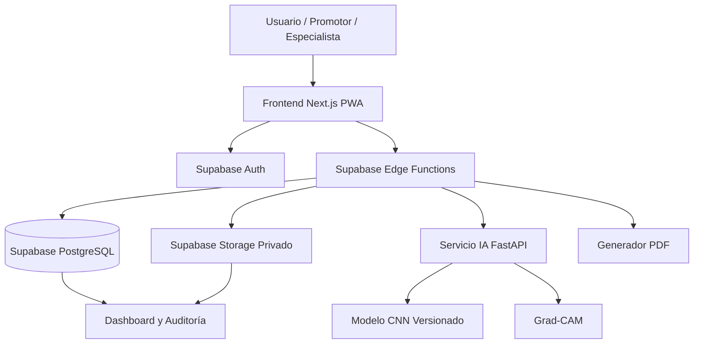
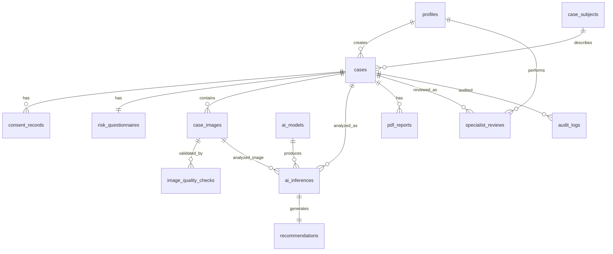

# Proyecto por fases — MVP OralDiagnostic

**Documento:** Especificación técnica profesional para Producto Mínimo Viable  
**Proyecto:** OralDiagnostic — Sistema inteligente de apoyo al triaje de lesiones bucales sospechosas mediante IA  
**Tipo:** Plataforma web progresiva, PWA, con frontend en Next.js y backend/base de datos en Supabase  
**Versión del documento:** 1.0  
**Fecha:** 2026-06-30  
**Autor técnico:** Ingeniería de Software Senior  

---

## 1. Propósito del documento

Este documento define, con nivel profesional y ejecutable, la planificación por fases del MVP de **OralDiagnostic**, incluyendo arquitectura, frontend, backend sobre Supabase, base de datos PostgreSQL, almacenamiento seguro, integración con inteligencia artificial, módulos funcionales, requerimientos, actores, relaciones, cardinalidad, criterios de aceptación, estándares y ejemplos contractuales para implementación asistida por MCP o agentes de desarrollo.

El objetivo es evitar ambigüedades técnicas y reducir el riesgo de que una herramienta automatizada “invente” estructura, nombres de tablas, rutas, roles, reglas clínicas, flujos o contratos de API.

---

## 2. Contexto del proyecto

OralDiagnostic será un sistema de apoyo al triaje preventivo de lesiones bucales sospechosas. El usuario podrá registrar un caso anónimo, responder un cuestionario clínico básico, capturar o cargar una imagen bucal, validar la calidad de imagen, ejecutar un análisis de IA, visualizar un nivel de sospecha visual, obtener una recomendación preventiva y, cuando corresponda, generar un reporte PDF de derivación profesional.

### 2.1 Principio clínico obligatorio

El sistema **no debe diagnosticar cáncer bucal**. El diagnóstico definitivo requiere evaluación clínica especializada y, cuando corresponda, confirmación histopatológica. El sistema solo debe orientar la priorización de casos, identificar señales visuales de riesgo y recomendar derivación profesional.

### 2.2 Alcance del MVP

El MVP debe incluir:

1. Registro anónimo de caso.
2. Consentimiento informado.
3. Cuestionario básico de riesgo.
4. Captura o carga de imagen.
5. Validación de calidad de imagen.
6. Clasificación IA en niveles de sospecha visual.
7. Generación de mapa Grad-CAM.
8. Motor de recomendación preventiva.
9. Reporte PDF de derivación.
10. Panel especialista para revisión de casos.
11. Dashboard básico de indicadores.
12. Auditoría, trazabilidad y control de acceso.

### 2.3 Fuera de alcance del MVP

No forman parte del MVP inicial:

1. Diagnóstico médico definitivo.
2. Historia clínica completa.
3. Firma digital avanzada.
4. Integración con laboratorios de biopsia.
5. App nativa Android/iOS.
6. Chat médico automatizado.
7. Geolocalización precisa del paciente.
8. Publicación pública de imágenes.
9. Entrenamiento automático continuo en producción.
10. Integración con sistemas hospitalarios HL7/FHIR, salvo diseño preparado para futuro.

---

## 3. Decisiones arquitectónicas principales

### 3.1 Decisión 1: PWA antes que app nativa

La primera versión debe ser una **PWA** para funcionar en navegador móvil y escritorio con un único código fuente. Esto reduce costo, complejidad, mantenimiento y tiempo de entrega.

### 3.2 Decisión 2: Supabase como backend principal

Supabase será usado como backend principal para:

1. Autenticación.
2. PostgreSQL.
3. Row Level Security.
4. Storage privado.
5. Edge Functions.
6. APIs generadas.
7. Auditoría y trazabilidad mediante tablas propias.

### 3.3 Decisión 3: IA como servicio separado y versionable

Aunque Supabase será el backend principal, la inferencia de IA pesada debe ejecutarse en un **servicio IA separado**. Motivos:

1. Los modelos CNN/Grad-CAM requieren dependencias pesadas como TensorFlow, OpenCV o librerías de procesamiento de imagen.
2. Supabase Edge Functions son excelentes para orquestación, validación, seguridad y llamadas HTTP, pero no son el entorno ideal para inferencia médica pesada.
3. Separar IA permite versionar modelos, escalar GPU/CPU de forma independiente y reemplazar modelos sin rediseñar la aplicación.

**Arquitectura final del MVP:**

```text
Usuario / Promotor / Especialista
        ↓
Frontend Next.js + TypeScript + PWA
        ↓
Supabase Auth + Supabase Edge Functions
        ↓
PostgreSQL + RLS + Storage privado
        ↓
Servicio IA FastAPI / TensorFlow
        ↓
Resultado IA + Grad-CAM + Recomendación + PDF
```

---

## 4. Arquitectura lógica general



### 4.1 Capas del sistema

| Capa | Tecnología | Responsabilidad |
|---|---|---|
| Presentación | Next.js, React, TypeScript, Tailwind CSS | Interfaz PWA, formularios, navegación, captura de imagen, resultados. |
| Seguridad de sesión | Supabase Auth | Login de usuarios internos, JWT, control por roles. |
| Backend principal | Supabase Edge Functions | Validaciones, flujo de negocio, invocación IA, PDF, control de acceso. |
| Base de datos | Supabase PostgreSQL | Persistencia transaccional, relaciones, auditoría, trazabilidad. |
| Almacenamiento | Supabase Storage privado | Imágenes originales, Grad-CAM y PDFs. |
| IA | FastAPI, Python, TensorFlow/Keras o PyTorch | Inferencia, clasificación, mapa de calor, métricas de modelo. |
| Observabilidad | Supabase logs, Sentry opcional | Errores, latencia, trazabilidad, auditoría técnica. |

---

## 5. Actores del sistema

| Actor | Descripción | Permisos principales |
|---|---|---|
| Visitante / Paciente anónimo | Persona que registra una lesión desde una campaña o enlace público. | Crear caso anónimo, aceptar consentimiento, responder cuestionario, subir imagen, ver resultado de su propio flujo activo. |
| Promotor de salud | Usuario autenticado que registra casos durante campañas preventivas. | Crear casos, cargar imágenes, generar reportes, consultar casos creados por él. |
| Odontólogo / Especialista | Profesional que revisa casos sospechosos. | Ver cola de revisión, revisar imágenes, corregir clasificación, registrar observaciones. |
| Administrador | Responsable técnico/funcional del sistema. | Gestionar usuarios, roles, modelos IA, reglas, dashboard y auditoría. |
| Investigador / Docente | Usuario de consulta académica controlada. | Ver métricas agregadas y datos anonimizados; no debe acceder a identidad ni imágenes sin permiso explícito. |
| Servicio IA | Servicio técnico externo/interno que procesa imágenes. | Recibir imagen firmada temporalmente, ejecutar modelo, devolver predicción y Grad-CAM. |
| Supabase Service Role | Identidad técnica restringida al backend. | Operaciones privilegiadas desde Edge Functions, nunca desde frontend. |

---

## 6. Roles y matriz de permisos

### 6.1 Roles técnicos

Los roles internos se manejarán en `public.profiles.role`:

```text
admin
specialist
promoter
researcher
```

El visitante anónimo no tendrá registro en `profiles`; su interacción será controlada mediante Edge Functions, tokens temporales y códigos de caso.

### 6.2 Matriz de permisos MVP

| Recurso / Acción | Anónimo | Promotor | Especialista | Investigador | Admin |
|---|---:|---:|---:|---:|---:|
| Crear caso | Sí, por Edge Function | Sí | Sí | No | Sí |
| Ver caso propio durante sesión | Sí, temporal | Sí | Sí | No | Sí |
| Listar casos | No | Solo creados por él | Cola asignada / sospechosos | No raw, solo agregados | Todos |
| Subir imagen | Sí, por URL firmada | Sí | Sí | No | Sí |
| Ejecutar IA | Sí, por flujo controlado | Sí | Sí | No | Sí |
| Ver imagen original | Temporal en flujo | Casos creados | Casos en revisión | No por defecto | Sí |
| Ver Grad-CAM | Sí, resultado propio | Sí | Sí | Agregado/no raw | Sí |
| Generar PDF | Sí, caso propio | Sí | Sí | No | Sí |
| Revisar caso | No | No | Sí | No | Sí |
| Gestionar modelos | No | No | No | No | Sí |
| Ver auditoría | No | No | Limitada | No | Sí |

---

## 7. Requerimientos funcionales

| Código | Requerimiento | Prioridad | Actor principal | Criterio de aceptación |
|---|---|---:|---|---|
| RF-01 | El sistema debe permitir iniciar un caso anónimo. | Alta | Anónimo / Promotor | Se genera `case_code` único sin solicitar nombre completo. |
| RF-02 | El sistema debe mostrar y registrar consentimiento informado. | Alta | Anónimo / Promotor | No se puede avanzar sin aceptación explícita. |
| RF-03 | El sistema debe registrar edad, sexo, ciudad/zona, zona bucal afectada y tiempo de evolución. | Alta | Anónimo / Promotor | Los campos obligatorios validan formato y rango. |
| RF-04 | El sistema debe presentar cuestionario de riesgo. | Alta | Anónimo / Promotor | Se guardan síntomas y factores de riesgo con fecha. |
| RF-05 | El sistema debe permitir capturar imagen desde cámara. | Alta | Anónimo / Promotor | En móvil abre cámara cuando el navegador lo permita. |
| RF-06 | El sistema debe permitir cargar imagen desde galería. | Alta | Anónimo / Promotor | Acepta JPG/PNG/WEBP dentro del límite definido. |
| RF-07 | El sistema debe validar calidad de imagen. | Alta | Sistema | Rechaza imagen borrosa, oscura, de baja resolución o formato inválido. |
| RF-08 | El sistema debe ejecutar IA solo si la imagen supera validación mínima. | Alta | Sistema | No se invoca IA cuando `quality_status = rejected`. |
| RF-09 | El sistema debe clasificar la imagen por nivel de sospecha visual. | Alta | Servicio IA | Devuelve `low`, `moderate` o `high` con probabilidad y versión de modelo. |
| RF-10 | El sistema debe generar mapa Grad-CAM. | Alta | Servicio IA | Se almacena imagen Grad-CAM en bucket privado. |
| RF-11 | El sistema debe combinar IA + cuestionario + reglas clínicas en una recomendación. | Alta | Sistema | La recomendación puede elevar prioridad aunque IA sea baja. |
| RF-12 | El sistema debe mostrar mensajes clínicamente prudentes. | Alta | Sistema | Ningún mensaje usa “diagnóstico de cáncer” como resultado final. |
| RF-13 | El sistema debe generar reporte PDF de derivación. | Alta | Anónimo / Promotor / Especialista | PDF incluye caso, cuestionario, resultado, advertencia médica, imagen y Grad-CAM. |
| RF-14 | El sistema debe permitir revisión especializada. | Alta | Especialista | El especialista confirma/corrige clasificación y deja observación. |
| RF-15 | El sistema debe registrar auditoría de acciones críticas. | Alta | Sistema | Crear caso, subir imagen, inferencia, PDF y revisión generan audit log. |
| RF-16 | El sistema debe mostrar dashboard de indicadores. | Media | Admin / Especialista | Visualiza casos por nivel, imágenes rechazadas, tiempos y revisiones. |
| RF-17 | El sistema debe gestionar modelos IA. | Media | Admin | Permite registrar versión, arquitectura, métricas y estado activo. |
| RF-18 | El sistema debe manejar errores recuperables. | Alta | Sistema | Si falla IA o PDF, el caso queda en estado recuperable con mensaje claro. |

---

## 8. Requerimientos no funcionales

| Categoría | Requerimiento | Especificación mínima MVP |
|---|---|---|
| Seguridad | Autenticación y autorización | Supabase Auth para usuarios internos, RLS en todas las tablas sensibles. |
| Privacidad | Minimización de datos | No solicitar nombre, cédula, teléfono ni dirección exacta en MVP. |
| Trazabilidad | Auditoría | Registrar actor, acción, entidad, fecha, IP hash y metadata segura. |
| Disponibilidad | Recuperación de errores | Estados de caso claros: `draft`, `image_rejected`, `analyzed`, `under_review`, etc. |
| Rendimiento | Respuesta de UI | Navegación inicial menor a 3 s en conexión razonable; inferencia objetivo 2–10 s. |
| Escalabilidad | Separación IA | IA aislada en servicio Docker escalable por CPU/GPU. |
| Mantenibilidad | Código modular | Separar UI, dominio, validaciones, servicios Supabase, tipos y contratos. |
| Observabilidad | Logs estructurados | Edge Functions y servicio IA deben emitir logs con `request_id` y `case_id`. |
| Accesibilidad | UI inclusiva | Formularios con labels, contraste adecuado, navegación móvil y mensajes claros. |
| Compatibilidad | Navegadores modernos | Chrome, Edge, Safari móvil moderno y Firefox moderno. |
| Integridad | Restricciones DB | PK, FK, `check`, `not null`, índices, enum controlado y timestamps UTC. |
| Ética IA | No sustitución médica | Todo resultado debe incluir advertencia de apoyo al triaje, no diagnóstico. |
| Portabilidad | Entorno reproducible | Docker para IA, Supabase CLI para local, `.env.example`, migraciones versionadas. |

---

## 9. Módulos del sistema

### 9.1 Módulos frontend

| Módulo | Ruta sugerida | Responsabilidad |
|---|---|---|
| Landing pública | `/` | Explicar propósito, límites y acceso a nuevo caso. |
| Consentimiento | `/casos/nuevo/consentimiento` | Mostrar términos y aceptación informada. |
| Registro de caso | `/casos/nuevo/datos` | Registrar datos mínimos anónimos. |
| Cuestionario | `/casos/nuevo/cuestionario` | Capturar síntomas y factores de riesgo. |
| Captura de imagen | `/casos/nuevo/imagen` | Cámara/galería, previsualización y recomendaciones de captura. |
| Procesamiento | `/casos/[caseCode]/procesando` | Mostrar estado: validación, IA, Grad-CAM, recomendación. |
| Resultado | `/casos/[caseCode]/resultado` | Mostrar nivel, probabilidad, advertencia, Grad-CAM y acciones. |
| PDF | `/casos/[caseCode]/reporte` | Descargar reporte generado. |
| Login interno | `/login` | Acceso de promotor, especialista y admin. |
| Panel especialista | `/panel/revision` | Cola de casos moderados/altos o pendientes. |
| Detalle especialista | `/panel/revision/[caseId]` | Ver caso, imagen, resultado, cuestionario y registrar revisión. |
| Dashboard | `/panel/dashboard` | Indicadores generales. |
| Administración | `/panel/admin` | Gestión de usuarios, modelos, reglas y auditoría. |

### 9.2 Módulos backend Supabase

| Módulo | Tipo | Responsabilidad |
|---|---|---|
| Auth | Supabase Auth | Login de usuarios internos. |
| Profiles | Tabla + RLS | Roles, estado e institución. |
| Cases | Tabla + Edge Functions | Flujo transaccional del caso. |
| Consent | Tabla | Registro de consentimiento informado. |
| Questionnaire | Tabla | Síntomas y factores de riesgo. |
| Images | Storage + tabla | Imágenes originales y derivadas. |
| Quality Check | Edge Function + tabla | Validación técnica de imagen. |
| IA Orchestrator | Edge Function | Invocar servicio IA y persistir resultado. |
| Recommendation Engine | Edge Function | Reglas preventivas combinadas. |
| Reports | Edge Function + Storage | Generación PDF y resguardo. |
| Reviews | Tabla + RLS | Validación por especialista. |
| Audit | Tabla | Registro de acciones críticas. |
| Dashboard | Views / RPC | Métricas agregadas. |

### 9.3 Módulo IA

| Submódulo | Responsabilidad |
|---|---|
| Preprocesamiento | Redimensionar, normalizar, verificar canales y preparar tensor. |
| Modelo CNN | Clasificar imagen según clases entrenadas. |
| Grad-CAM | Generar mapa visual de zonas relevantes para el modelo. |
| Versionado | Registrar arquitectura, versión, pesos, input shape y métricas. |
| API IA | Exponer endpoint HTTP seguro para inferencia. |
| Validación técnica | Registrar latencia, errores y metadata de inferencia. |

---

## 10. Stack tecnológico recomendado

### 10.1 Frontend

| Área | Librería / tecnología | Uso |
|---|---|---|
| Framework | Next.js 16.x con App Router | Aplicación full-stack/PWA con rutas modernas. |
| Lenguaje | TypeScript | Tipado estricto y contratos claros. |
| UI | React 19.x | Componentes de interfaz. |
| Estilos | Tailwind CSS | Diseño responsive y consistente. |
| Componentes | shadcn/ui | Base UI accesible y personalizable. |
| Iconos | lucide-react | Iconografía consistente. |
| Formularios | react-hook-form | Formularios performantes. |
| Validación | zod | Validación compartida frontend/backend. |
| Datos remotos | @tanstack/react-query | Cache, loading states, reintentos controlados. |
| Supabase client | @supabase/supabase-js | Conexión segura al backend desde cliente/servidor. |
| Gráficos | recharts | Dashboard MVP. |
| Fechas | date-fns | Formato y manipulación de fechas. |
| Cámara | HTML Media Capture / getUserMedia | Captura móvil desde navegador. |
| Calidad imagen cliente | browser-image-compression opcional | Reducción previa antes de subir, sin reemplazar validación backend. |
| Notificaciones UI | sonner | Toasts claros. |
| Testing unitario | Vitest + Testing Library | Pruebas de componentes y lógica. |
| Testing E2E | Playwright | Flujos completos del MVP. |

### 10.2 Backend Supabase

| Área | Tecnología | Uso |
|---|---|---|
| Base de datos | PostgreSQL en Supabase | Persistencia relacional. |
| Seguridad de filas | Row Level Security | Control por usuario/rol. |
| Autenticación | Supabase Auth | Usuarios internos. |
| Storage | Supabase Storage privado | Imágenes, Grad-CAM, PDF. |
| Serverless | Supabase Edge Functions | Orquestación, validaciones, IA, PDF. |
| CLI | Supabase CLI | Desarrollo local, migraciones y despliegue. |
| Validación | zod o validación manual TS | Validar payloads en Edge Functions. |
| PDF | pdf-lib | Generación PDF en función backend. |
| Observabilidad | Supabase Logs + Sentry opcional | Trazas, errores y métricas. |

### 10.3 Servicio IA

| Área | Tecnología | Uso |
|---|---|---|
| API | FastAPI | Endpoint de inferencia. |
| Runtime | Python 3.11+ | Ecosistema IA estable. |
| Modelo | TensorFlow/Keras | Entrenamiento e inferencia CNN. |
| Imagen | OpenCV / Pillow | Preprocesamiento, calidad y Grad-CAM. |
| Contenedor | Docker | Portabilidad y despliegue reproducible. |
| Servidor | Uvicorn/Gunicorn | Servir FastAPI. |
| Métricas | scikit-learn | Accuracy, precision, recall, F1, matriz de confusión. |
| Tracking opcional | MLflow | Registro avanzado de experimentos. |

---

## 11. Estructura recomendada del repositorio

```text
oraldiagnostic/
├── apps/
│   └── web/
│       ├── src/
│       │   ├── app/
│       │   │   ├── (public)/
│       │   │   ├── (auth)/login/
│       │   │   ├── casos/
│       │   │   └── panel/
│       │   ├── components/
│       │   │   ├── ui/
│       │   │   ├── forms/
│       │   │   ├── case/
│       │   │   ├── image/
│       │   │   └── dashboard/
│       │   ├── features/
│       │   │   ├── cases/
│       │   │   ├── questionnaire/
│       │   │   ├── images/
│       │   │   ├── inference/
│       │   │   ├── reports/
│       │   │   └── reviews/
│       │   ├── lib/
│       │   │   ├── supabase/
│       │   │   ├── validations/
│       │   │   ├── constants/
│       │   │   └── utils/
│       │   ├── types/
│       │   └── middleware.ts
│       ├── public/
│       │   ├── icon-192x192.png
│       │   └── icon-512x512.png
│       ├── package.json
│       └── .env.example
├── supabase/
│   ├── migrations/
│   ├── functions/
│   │   ├── create-case/
│   │   ├── request-image-upload/
│   │   ├── validate-image/
│   │   ├── run-inference/
│   │   ├── generate-report/
│   │   ├── review-case/
│   │   └── dashboard-metrics/
│   ├── seed.sql
│   └── config.toml
├── services/
│   └── ai/
│       ├── app/
│       │   ├── main.py
│       │   ├── inference.py
│       │   ├── gradcam.py
│       │   ├── preprocessing.py
│       │   └── schemas.py
│       ├── models/
│       ├── tests/
│       ├── Dockerfile
│       └── requirements.txt
├── docs/
│   ├── arquitectura.md
│   ├── api-contracts.md
│   ├── database.md
│   └── qa.md
└── README.md
```

---

## 12. Frontend — especificación detallada

### 12.1 Principios frontend

1. Mobile first.
2. Flujo guiado paso a paso.
3. Mensajes médicos prudentes.
4. Validaciones antes de enviar al backend.
5. Sin exponer claves secretas.
6. Sin acceso directo a tablas sensibles desde usuario anónimo.
7. Componentes reutilizables y tipados.
8. Separación por features.

### 12.2 Estados principales del flujo de caso

```text
START
  ↓
CONSENT_ACCEPTED
  ↓
DEMOGRAPHICS_COMPLETED
  ↓
QUESTIONNAIRE_COMPLETED
  ↓
IMAGE_SELECTED
  ↓
IMAGE_UPLOADED
  ↓
QUALITY_CHECK_PENDING
  ↓
QUALITY_ACCEPTED / QUALITY_REJECTED
  ↓
AI_PENDING
  ↓
AI_COMPLETED / AI_FAILED
  ↓
RECOMMENDATION_READY
  ↓
PDF_READY
  ↓
SPECIALIST_REVIEW_PENDING opcional
```

### 12.3 Validaciones frontend mínimas

| Campo | Regla |
|---|---|
| Edad | Número entero entre 0 y 120. |
| Sexo | Enum controlado: `female`, `male`, `other`, `not_specified`. |
| Ciudad/zona | Texto corto, máximo 120 caracteres, sin dirección exacta. |
| Zona bucal | Enum controlado. |
| Tiempo evolución | Entero en días, mínimo 0, máximo 3650. |
| Imagen | JPG, PNG o WEBP; máximo 10 MB; mínimo 640x480 recomendado. |
| Consentimiento | Booleano obligatorio. |

### 12.4 Componentes frontend obligatorios

| Componente | Descripción |
|---|---|
| `ConsentCard` | Explica alcance y limita responsabilidad diagnóstica. |
| `CaseStepper` | Muestra avance del flujo. |
| `DemographicsForm` | Datos anónimos. |
| `RiskQuestionnaireForm` | Síntomas y factores de riesgo. |
| `ImageCaptureUploader` | Cámara/galería, drag & drop y preview. |
| `ImageQualityGuide` | Consejos visuales para buena captura. |
| `ProcessingTimeline` | Estado de validación, IA, Grad-CAM y PDF. |
| `SuspicionResultCard` | Resultado bajo/moderado/alto con lenguaje prudente. |
| `GradCamViewer` | Imagen original y mapa Grad-CAM con advertencia. |
| `ReferralReportButton` | Solicita generación/descarga PDF. |
| `SpecialistCaseQueue` | Cola de revisión. |
| `SpecialistReviewForm` | Confirmación/corrección de clasificación. |
| `DashboardCards` | Métricas principales. |

### 12.5 Ejemplo de schema Zod para cuestionario

```ts
import { z } from 'zod';

export const riskQuestionnaireSchema = z.object({
  lesion_duration_days: z.number().int().min(0).max(3650),
  pain: z.boolean(),
  bleeding: z.boolean(),
  growth: z.boolean(),
  white_patch: z.boolean(),
  red_patch: z.boolean(),
  non_healing_ulcer: z.boolean(),
  lump_or_induration: z.boolean(),
  dysphagia: z.boolean(),
  tobacco_use: z.boolean(),
  alcohol_use: z.boolean(),
  coca_chewing: z.boolean(),
  coca_machucada: z.boolean(),
  bicarbonate_or_additives: z.boolean(),
  dental_prosthesis: z.boolean(),
  constant_friction: z.boolean(),
  notes: z.string().max(1000).optional(),
});
```

### 12.6 Ejemplo de copy obligatorio en UI

```text
Este sistema no emite diagnóstico médico. El resultado es una orientación preventiva de apoyo al triaje. Si la lesión persiste, sangra, duele, crece o presenta cambios de color, acuda a evaluación odontológica o médica especializada.
```

### 12.7 Textos prohibidos

No usar:

```text
La IA detectó cáncer.
Tiene cáncer bucal.
Resultado positivo para cáncer.
No tiene cáncer.
La lesión es benigna.
La lesión es maligna.
```

Usar:

```text
Baja sospecha visual.
Sospecha moderada.
Sospecha alta.
Se recomienda evaluación profesional.
El sistema no confirma ni descarta cáncer.
```

---

## 13. Supabase backend — especificación detallada

### 13.1 Principios backend

1. Toda operación sensible debe pasar por Edge Functions o RLS.
2. El frontend anónimo no debe insertar directamente en tablas sensibles.
3. Las imágenes deben almacenarse en buckets privados.
4. Las URLs firmadas deben tener expiración corta.
5. Toda inferencia debe guardar versión de modelo.
6. Todo reporte PDF debe guardar hash y ruta privada.
7. Toda acción crítica debe generar auditoría.
8. Las reglas de recomendación deben ser conservadoras.

### 13.2 Edge Functions requeridas

| Función | Método | Responsabilidad |
|---|---|---|
| `create-case` | POST | Crear caso, consentimiento y datos mínimos. |
| `request-image-upload` | POST | Crear registro de imagen y URL firmada para upload. |
| `validate-image` | POST | Validar formato/calidad y actualizar estado. |
| `run-inference` | POST | Invocar servicio IA y persistir resultado. |
| `generate-report` | POST | Crear PDF de derivación y guardarlo. |
| `review-case` | POST | Guardar revisión especialista. |
| `dashboard-metrics` | GET | Devolver indicadores agregados. |

### 13.3 Contrato: `create-case`

#### Request

```json
{
  "consent": {
    "accepted": true,
    "consent_version": "2026-06-30-v1"
  },
  "demographics": {
    "age_years": 45,
    "sex": "female",
    "city": "Santa Cruz",
    "zone": "Zona norte"
  },
  "case": {
    "lesion_site": "tongue",
    "lesion_duration_days": 21
  }
}
```

#### Response

```json
{
  "case_id": "uuid",
  "case_code": "OD-20260630-A1B2C3D4",
  "status": "draft",
  "next_step": "questionnaire"
}
```

### 13.4 Contrato: `run-inference`

#### Request

```json
{
  "case_id": "uuid",
  "image_id": "uuid"
}
```

#### Response

```json
{
  "case_id": "uuid",
  "image_id": "uuid",
  "model": {
    "name": "oral-lesion-triage-cnn",
    "version": "1.0.0",
    "architecture": "mobilenetv3-small"
  },
  "prediction": {
    "suspicion_level": "moderate",
    "probability": 0.53,
    "class_probabilities": {
      "low": 0.28,
      "moderate": 0.53,
      "high": 0.19
    }
  },
  "gradcam": {
    "image_id": "uuid",
    "storage_path": "gradcam/OD-20260630-A1B2C3D4/gradcam.png"
  },
  "recommendation": {
    "level": "priority",
    "message": "La imagen presenta características que justifican revisión profesional. El sistema no confirma cáncer.",
    "reason_codes": ["AI_MODERATE", "LESION_OVER_14_DAYS"]
  }
}
```

### 13.5 Contrato: `review-case`

#### Request

```json
{
  "case_id": "uuid",
  "decision": "correct_ai",
  "corrected_suspicion_level": "high",
  "clinical_notes": "La imagen no permite diagnóstico, pero se observa lesión persistente compatible con derivación prioritaria.",
  "recommended_action": "Derivar a estomatología u odontología especializada."
}
```

#### Response

```json
{
  "review_id": "uuid",
  "case_id": "uuid",
  "status": "reviewed",
  "created_at": "2026-06-30T15:30:00Z"
}
```

---

## 14. Base de datos Supabase — estándares obligatorios

### 14.1 Estándares de diseño

1. Usar PostgreSQL relacional normalizado.
2. Usar nombres en `snake_case`.
3. Usar UUID como clave primaria.
4. Usar `timestamptz` para fechas.
5. Guardar fechas en UTC.
6. Usar `created_at` y `updated_at` donde aplique.
7. Usar enums para estados finitos.
8. Usar `jsonb` solo para metadata flexible, no para reemplazar relaciones principales.
9. Usar claves foráneas explícitas.
10. Definir `on delete` conscientemente.
11. Crear índices para consultas frecuentes.
12. Activar RLS en tablas sensibles.
13. Evitar PII innecesaria.
14. Usar hash para IP/user-agent cuando se audite.
15. Versionar toda migración en `supabase/migrations`.

### 14.2 Entidades principales

| Tabla | Propósito |
|---|---|
| `profiles` | Usuarios internos y roles. |
| `case_subjects` | Datos anónimos mínimos del sujeto/caso. |
| `cases` | Caso principal de triaje. |
| `consent_records` | Consentimiento informado. |
| `risk_questionnaires` | Cuestionario clínico básico. |
| `case_images` | Metadata de imágenes originales y derivadas. |
| `image_quality_checks` | Resultado de validación de calidad. |
| `ai_models` | Catálogo de modelos IA versionados. |
| `ai_inferences` | Resultados de inferencia IA. |
| `recommendations` | Recomendación preventiva generada. |
| `pdf_reports` | Reportes PDF generados. |
| `specialist_reviews` | Revisión profesional del caso. |
| `audit_logs` | Auditoría de acciones críticas. |
| `triage_rules` | Reglas configurables de recomendación. |

---

## 15. Relaciones y cardinalidad

| Relación | Cardinalidad | Descripción |
|---|---|---|
| `profiles` → `cases` | 1:N | Un usuario interno puede crear muchos casos. |
| `case_subjects` → `cases` | 1:N | Un sujeto anónimo puede tener uno o más casos; en MVP normalmente 1. |
| `cases` → `consent_records` | 1:N | Un caso puede tener varios consentimientos/versiones, mínimo uno aceptado. |
| `cases` → `risk_questionnaires` | 1:1 MVP | Un caso tiene un cuestionario principal. Se permite histórico si se requiere. |
| `cases` → `case_images` | 1:N | Un caso puede tener imagen original, recapturas y derivadas. |
| `case_images` → `image_quality_checks` | 1:N | Una imagen puede tener varias validaciones; se usa la última válida. |
| `ai_models` → `ai_inferences` | 1:N | Un modelo puede generar muchas inferencias. |
| `cases` → `ai_inferences` | 1:N | Un caso puede tener varias inferencias si se reanaliza. |
| `case_images` → `ai_inferences` | 1:N | Una imagen puede ser analizada por varios modelos. |
| `ai_inferences` → `recommendations` | 1:1 | Una inferencia genera una recomendación principal. |
| `cases` → `pdf_reports` | 1:N | Un caso puede tener reportes regenerados. |
| `cases` → `specialist_reviews` | 1:N | Un caso puede recibir una o más revisiones. |
| `profiles` → `specialist_reviews` | 1:N | Un especialista puede revisar muchos casos. |
| `cases` → `audit_logs` | 1:N | Muchas acciones pueden quedar asociadas a un caso. |

### 15.1 Diagrama ERD



---

## 16. Migración SQL base del MVP

> Esta migración es una base inicial. Debe guardarse como `supabase/migrations/0001_initial_schema.sql`.

```sql
create extension if not exists pgcrypto;

create type public.app_role as enum (
  'admin',
  'specialist',
  'promoter',
  'researcher'
);

create type public.biological_sex as enum (
  'female',
  'male',
  'other',
  'not_specified'
);

create type public.case_status as enum (
  'draft',
  'questionnaire_completed',
  'image_uploaded',
  'image_rejected',
  'analyzed',
  'reported',
  'under_review',
  'reviewed',
  'closed',
  'failed'
);

create type public.lesion_site as enum (
  'lip',
  'tongue',
  'gum',
  'palate',
  'floor_of_mouth',
  'cheek_mucosa',
  'other',
  'not_specified'
);

create type public.capture_source as enum (
  'camera',
  'gallery'
);

create type public.image_kind as enum (
  'original',
  'gradcam',
  'report_embedded'
);

create type public.image_quality_status as enum (
  'pending',
  'accepted',
  'rejected'
);

create type public.suspicion_level as enum (
  'invalid_image',
  'low',
  'moderate',
  'high'
);

create type public.urgency_level as enum (
  'none',
  'routine',
  'priority',
  'urgent'
);

create type public.review_decision as enum (
  'confirm_ai',
  'correct_ai',
  'needs_clinical_evaluation',
  'insufficient_information'
);

create table public.profiles (
  id uuid primary key references auth.users(id) on delete cascade,
  full_name text not null,
  role public.app_role not null default 'promoter',
  institution text,
  is_active boolean not null default true,
  created_at timestamptz not null default now(),
  updated_at timestamptz not null default now()
);

create table public.case_subjects (
  id uuid primary key default gen_random_uuid(),
  age_years smallint check (age_years between 0 and 120),
  sex public.biological_sex not null default 'not_specified',
  city text check (char_length(city) <= 120),
  zone text check (char_length(zone) <= 120),
  created_at timestamptz not null default now()
);

create table public.cases (
  id uuid primary key default gen_random_uuid(),
  case_code text not null unique,
  subject_id uuid not null references public.case_subjects(id) on delete restrict,
  created_by uuid references public.profiles(id) on delete set null,
  status public.case_status not null default 'draft',
  lesion_site public.lesion_site not null default 'not_specified',
  lesion_duration_days integer not null check (lesion_duration_days between 0 and 3650),
  final_suspicion_level public.suspicion_level,
  final_urgency_level public.urgency_level,
  final_recommendation text,
  clinical_disclaimer_acknowledged boolean not null default false,
  created_at timestamptz not null default now(),
  updated_at timestamptz not null default now(),
  closed_at timestamptz
);

create table public.consent_records (
  id uuid primary key default gen_random_uuid(),
  case_id uuid not null references public.cases(id) on delete cascade,
  accepted boolean not null,
  consent_version text not null,
  accepted_at timestamptz not null default now(),
  ip_hash text,
  user_agent_hash text,
  metadata jsonb not null default '{}'::jsonb
);

create table public.risk_questionnaires (
  id uuid primary key default gen_random_uuid(),
  case_id uuid not null unique references public.cases(id) on delete cascade,
  pain boolean not null default false,
  bleeding boolean not null default false,
  growth boolean not null default false,
  white_patch boolean not null default false,
  red_patch boolean not null default false,
  non_healing_ulcer boolean not null default false,
  lump_or_induration boolean not null default false,
  dysphagia boolean not null default false,
  tobacco_use boolean not null default false,
  alcohol_use boolean not null default false,
  coca_chewing boolean not null default false,
  coca_machucada boolean not null default false,
  bicarbonate_or_additives boolean not null default false,
  dental_prosthesis boolean not null default false,
  constant_friction boolean not null default false,
  notes text check (char_length(notes) <= 1000),
  risk_score numeric(5,2),
  created_at timestamptz not null default now(),
  updated_at timestamptz not null default now()
);

create table public.case_images (
  id uuid primary key default gen_random_uuid(),
  case_id uuid not null references public.cases(id) on delete cascade,
  image_kind public.image_kind not null default 'original',
  capture_source public.capture_source,
  bucket_name text not null,
  object_path text not null,
  mime_type text not null,
  size_bytes integer not null check (size_bytes > 0),
  width_px integer check (width_px > 0),
  height_px integer check (height_px > 0),
  sha256_hash text,
  uploaded_by uuid references public.profiles(id) on delete set null,
  created_at timestamptz not null default now(),
  unique(bucket_name, object_path)
);

create table public.image_quality_checks (
  id uuid primary key default gen_random_uuid(),
  image_id uuid not null references public.case_images(id) on delete cascade,
  status public.image_quality_status not null,
  sharpness_score numeric(8,3),
  brightness_score numeric(8,3),
  contrast_score numeric(8,3),
  resolution_ok boolean not null default false,
  focus_ok boolean not null default false,
  illumination_ok boolean not null default false,
  rejection_reasons text[] not null default '{}',
  metadata jsonb not null default '{}'::jsonb,
  created_at timestamptz not null default now()
);

create table public.ai_models (
  id uuid primary key default gen_random_uuid(),
  name text not null,
  version text not null,
  architecture text not null,
  storage_path text,
  input_shape jsonb not null,
  class_labels jsonb not null,
  threshold_config jsonb not null,
  metrics jsonb not null default '{}'::jsonb,
  is_active boolean not null default false,
  created_at timestamptz not null default now(),
  unique(name, version)
);

create table public.ai_inferences (
  id uuid primary key default gen_random_uuid(),
  case_id uuid not null references public.cases(id) on delete cascade,
  image_id uuid not null references public.case_images(id) on delete restrict,
  model_id uuid not null references public.ai_models(id) on delete restrict,
  suspicion_level public.suspicion_level not null,
  probability numeric(6,5) not null check (probability >= 0 and probability <= 1),
  class_probabilities jsonb not null,
  gradcam_image_id uuid references public.case_images(id) on delete set null,
  latency_ms integer check (latency_ms >= 0),
  service_request_id text,
  metadata jsonb not null default '{}'::jsonb,
  created_at timestamptz not null default now()
);

create table public.recommendations (
  id uuid primary key default gen_random_uuid(),
  case_id uuid not null references public.cases(id) on delete cascade,
  inference_id uuid references public.ai_inferences(id) on delete set null,
  suspicion_level public.suspicion_level not null,
  urgency_level public.urgency_level not null,
  professional_referral boolean not null default false,
  reason_codes text[] not null default '{}',
  message text not null,
  created_at timestamptz not null default now()
);

create table public.pdf_reports (
  id uuid primary key default gen_random_uuid(),
  case_id uuid not null references public.cases(id) on delete cascade,
  generated_by uuid references public.profiles(id) on delete set null,
  bucket_name text not null,
  object_path text not null,
  report_hash text,
  report_version text not null default 'mvp-v1',
  created_at timestamptz not null default now(),
  unique(bucket_name, object_path)
);

create table public.specialist_reviews (
  id uuid primary key default gen_random_uuid(),
  case_id uuid not null references public.cases(id) on delete cascade,
  reviewed_by uuid not null references public.profiles(id) on delete restrict,
  decision public.review_decision not null,
  corrected_suspicion_level public.suspicion_level,
  clinical_notes text not null check (char_length(clinical_notes) <= 5000),
  recommended_action text check (char_length(recommended_action) <= 2000),
  created_at timestamptz not null default now()
);

create table public.triage_rules (
  id uuid primary key default gen_random_uuid(),
  code text not null unique,
  description text not null,
  is_active boolean not null default true,
  rule_config jsonb not null,
  created_at timestamptz not null default now(),
  updated_at timestamptz not null default now()
);

create table public.audit_logs (
  id uuid primary key default gen_random_uuid(),
  actor_id uuid references public.profiles(id) on delete set null,
  action text not null,
  entity_type text not null,
  entity_id uuid,
  case_id uuid references public.cases(id) on delete set null,
  ip_hash text,
  user_agent_hash text,
  metadata jsonb not null default '{}'::jsonb,
  created_at timestamptz not null default now()
);

create index idx_cases_status_created_at on public.cases(status, created_at desc);
create index idx_cases_case_code on public.cases(case_code);
create index idx_cases_created_by on public.cases(created_by);
create index idx_case_images_case_id on public.case_images(case_id);
create index idx_quality_image_id_created_at on public.image_quality_checks(image_id, created_at desc);
create index idx_ai_inferences_case_id_created_at on public.ai_inferences(case_id, created_at desc);
create index idx_recommendations_case_id_created_at on public.recommendations(case_id, created_at desc);
create index idx_reviews_case_id_created_at on public.specialist_reviews(case_id, created_at desc);
create index idx_audit_case_id_created_at on public.audit_logs(case_id, created_at desc);

create or replace function public.set_updated_at()
returns trigger
language plpgsql
as $$
begin
  new.updated_at = now();
  return new;
end;
$$;

create trigger profiles_set_updated_at
before update on public.profiles
for each row execute function public.set_updated_at();

create trigger cases_set_updated_at
before update on public.cases
for each row execute function public.set_updated_at();

create trigger questionnaire_set_updated_at
before update on public.risk_questionnaires
for each row execute function public.set_updated_at();

create trigger triage_rules_set_updated_at
before update on public.triage_rules
for each row execute function public.set_updated_at();
```

---

## 17. RLS — políticas mínimas

### 17.1 Activar RLS

```sql
alter table public.profiles enable row level security;
alter table public.case_subjects enable row level security;
alter table public.cases enable row level security;
alter table public.consent_records enable row level security;
alter table public.risk_questionnaires enable row level security;
alter table public.case_images enable row level security;
alter table public.image_quality_checks enable row level security;
alter table public.ai_models enable row level security;
alter table public.ai_inferences enable row level security;
alter table public.recommendations enable row level security;
alter table public.pdf_reports enable row level security;
alter table public.specialist_reviews enable row level security;
alter table public.triage_rules enable row level security;
alter table public.audit_logs enable row level security;
```

### 17.2 Helper de rol

```sql
create or replace function public.current_user_role()
returns public.app_role
language sql
security definer
set search_path = public
stable
as $$
  select role from public.profiles where id = auth.uid() and is_active = true;
$$;
```

### 17.3 Políticas base

```sql
create policy "profiles_select_own_or_admin"
on public.profiles
for select
to authenticated
using (
  id = auth.uid()
  or public.current_user_role() = 'admin'
);

create policy "cases_select_by_role"
on public.cases
for select
to authenticated
using (
  created_by = auth.uid()
  or public.current_user_role() in ('admin', 'specialist')
);

create policy "cases_insert_promoter_admin_specialist"
on public.cases
for insert
to authenticated
with check (
  public.current_user_role() in ('admin', 'specialist', 'promoter')
);

create policy "questionnaire_select_by_case_access"
on public.risk_questionnaires
for select
to authenticated
using (
  exists (
    select 1
    from public.cases c
    where c.id = risk_questionnaires.case_id
      and (
        c.created_by = auth.uid()
        or public.current_user_role() in ('admin', 'specialist')
      )
  )
);

create policy "reviews_select_specialist_admin"
on public.specialist_reviews
for select
to authenticated
using (
  public.current_user_role() in ('admin', 'specialist')
);

create policy "reviews_insert_specialist_admin"
on public.specialist_reviews
for insert
to authenticated
with check (
  public.current_user_role() in ('admin', 'specialist')
  and reviewed_by = auth.uid()
);

create policy "ai_models_select_authenticated"
on public.ai_models
for select
to authenticated
using (true);

create policy "ai_models_write_admin"
on public.ai_models
for all
to authenticated
using (public.current_user_role() = 'admin')
with check (public.current_user_role() = 'admin');
```

### 17.4 Nota crítica sobre anónimos

Los usuarios anónimos **no deben tener acceso directo** a tablas sensibles. Para ellos se debe usar:

1. Edge Function `create-case` con validación estricta.
2. Token temporal de caso.
3. URLs firmadas para carga/lectura puntual.
4. Expiración corta.
5. Auditoría sin datos identificables.

---

## 18. Supabase Storage

### 18.1 Buckets privados

| Bucket | Público | Contenido |
|---|---:|---|
| `case-originals` | No | Imágenes originales cargadas por usuario/promotor. |
| `case-gradcam` | No | Mapas Grad-CAM generados. |
| `case-reports` | No | Reportes PDF de derivación. |

### 18.2 Convención de rutas

```text
case-originals/{case_code}/{image_id}.jpg
case-gradcam/{case_code}/{inference_id}.png
case-reports/{case_code}/{report_id}.pdf
```

### 18.3 Políticas de acceso

1. Ningún bucket debe ser público.
2. El frontend solo debe recibir URLs firmadas temporales.
3. Las URLs para visualizar imágenes deben expirar en 5–15 minutos.
4. Las URLs para subir imagen deben expirar en 5 minutos.
5. Los reportes PDF deben generarse y servirse con URL firmada.

---

## 19. Motor de recomendación preventiva

### 19.1 Entradas

El motor debe combinar:

1. Nivel IA: `low`, `moderate`, `high`.
2. Probabilidad IA.
3. Tiempo de evolución.
4. Síntomas.
5. Factores de riesgo.
6. Calidad de imagen.
7. Reglas conservadoras.

### 19.2 Reglas MVP

| Código | Regla | Resultado |
|---|---|---|
| RULE-01 | Imagen rechazada por calidad. | No ejecutar IA; solicitar nueva imagen. |
| RULE-02 | IA alta. | Recomendación prioritaria/urgente. |
| RULE-03 | IA moderada. | Recomendar evaluación profesional. |
| RULE-04 | Lesión > 14 días + úlcera/mancha roja/mancha blanca/sangrado/crecimiento/bulto. | Elevar recomendación a profesional aunque IA sea baja. |
| RULE-05 | Dificultad para tragar + crecimiento o bulto. | Recomendar evaluación prioritaria. |
| RULE-06 | IA baja pero lesión persiste o empeora. | Monitoreo y consulta si persiste. |

### 19.3 Pseudocódigo

```ts
function calculateRecommendation(input: RecommendationInput): RecommendationOutput {
  if (input.imageQualityStatus === 'rejected') {
    return {
      suspicionLevel: 'invalid_image',
      urgencyLevel: 'none',
      professionalReferral: false,
      reasonCodes: ['IMAGE_QUALITY_REJECTED'],
      message: 'La imagen no tiene calidad suficiente. Repita la captura con buena iluminación y enfoque.'
    };
  }

  const alertSymptoms = [
    input.nonHealingUlcer,
    input.redPatch,
    input.whitePatch,
    input.bleeding,
    input.growth,
    input.lumpOrInduration
  ].some(Boolean);

  if (input.aiLevel === 'high') {
    return highPriority(['AI_HIGH']);
  }

  if (input.lesionDurationDays > 14 && alertSymptoms) {
    return priorityReferral(['LESION_OVER_14_DAYS', 'ALERT_SYMPTOMS']);
  }

  if (input.aiLevel === 'moderate') {
    return professionalReferral(['AI_MODERATE']);
  }

  return routineMonitoring(['AI_LOW']);
}
```

---

## 20. Niveles de resultado

| Nivel | Rango orientativo | Mensaje base | Acción |
|---|---:|---|---|
| Baja sospecha visual | 0–25% | No se observan signos visuales relevantes en esta imagen. | Monitorear; consultar si persiste, duele, sangra o crece. |
| Sospecha moderada | 26–55% | La imagen presenta características que justifican revisión profesional. | Consulta con odontólogo/estomatólogo. |
| Sospecha alta | 56–100% | La imagen presenta características visuales que requieren evaluación profesional prioritaria. | Evaluación prioritaria; el sistema no confirma cáncer. |
| Imagen inválida | N/A | La imagen no tiene calidad suficiente para análisis. | Repetir captura. |

---

## 21. Servicio IA — especificación

### 21.1 API IA

Endpoint:

```text
POST /v1/inference/oral-lesion
```

Headers:

```text
Authorization: Bearer {AI_SERVICE_TOKEN}
Content-Type: application/json
X-Request-Id: {uuid}
```

Request:

```json
{
  "case_id": "uuid",
  "image_id": "uuid",
  "image_url": "signed-url-temporal",
  "model_name": "oral-lesion-triage-cnn",
  "requested_outputs": ["classification", "gradcam"]
}
```

Response:

```json
{
  "request_id": "uuid",
  "model_name": "oral-lesion-triage-cnn",
  "model_version": "1.0.0",
  "architecture": "mobilenetv3-small",
  "input_shape": [224, 224, 3],
  "suspicion_level": "moderate",
  "probability": 0.53,
  "class_probabilities": {
    "low": 0.28,
    "moderate": 0.53,
    "high": 0.19
  },
  "gradcam_base64_png": "base64...",
  "latency_ms": 2140,
  "warnings": []
}
```

### 21.2 Modelos candidatos

| Modelo | Uso propuesto | Ventaja | Riesgo |
|---|---|---|---|
| MobileNetV3 Small/Large | MVP recomendado | Ligero, rápido, viable para despliegue económico. | Puede sacrificar precisión. |
| EfficientNet-B0 | Comparación técnica | Buen equilibrio precisión/tamaño. | Algo más pesado. |
| ResNet50 | Línea base académica | Arquitectura conocida y explicable. | Mayor peso y latencia. |

### 21.3 Métricas mínimas

1. Accuracy.
2. Precision.
3. Recall / sensibilidad.
4. F1-score.
5. Matriz de confusión.
6. Tiempo promedio de inferencia.
7. Tamaño del modelo.
8. Tasa de falsos negativos en clase sospechosa.

### 21.4 Condición de aceptación del modelo

Para el MVP académico, el modelo puede aceptarse si:

1. Ejecuta inferencia de punta a punta.
2. Devuelve probabilidad y nivel.
3. Genera Grad-CAM.
4. Registra versión.
5. Presenta métricas documentadas.
6. Reconoce limitaciones del dataset.
7. No se presenta como diagnóstico clínico.

---

## 22. Reporte PDF de derivación

### 22.1 Contenido mínimo

1. Logo/nombre del sistema.
2. Código anónimo de caso.
3. Fecha y hora.
4. Datos anónimos: edad, sexo, ciudad/zona general.
5. Zona bucal afectada.
6. Tiempo de evolución.
7. Resumen de síntomas/factores.
8. Calidad de imagen.
9. Resultado IA.
10. Nivel de sospecha visual.
11. Recomendación preventiva.
12. Imagen original.
13. Mapa Grad-CAM.
14. Advertencia médica.
15. Versión del modelo.
16. ID/hash del reporte.

### 22.2 Advertencia obligatoria en PDF

```text
IMPORTANTE: Este reporte es una herramienta de apoyo al triaje preventivo. No constituye diagnóstico médico ni confirma cáncer bucal. El diagnóstico definitivo requiere evaluación clínica por un profesional de salud y, cuando corresponda, estudios complementarios o biopsia.
```

---

## 23. Dashboard MVP

### 23.1 Indicadores principales

| Indicador | Fuente |
|---|---|
| Total de casos | `cases` |
| Casos por estado | `cases.status` |
| Casos por nivel de sospecha | `recommendations.suspicion_level` |
| Imágenes rechazadas por calidad | `image_quality_checks.status` |
| Promedio de latencia IA | `ai_inferences.latency_ms` |
| Casos pendientes de revisión | `cases.status = 'under_review'` |
| Revisiones realizadas | `specialist_reviews` |
| Modelos activos | `ai_models.is_active` |

### 23.2 Vista SQL sugerida

```sql
create or replace view public.v_dashboard_metrics as
select
  count(*) filter (where c.created_at >= now() - interval '30 days') as cases_last_30_days,
  count(*) as total_cases,
  count(*) filter (where c.status = 'under_review') as pending_review,
  count(*) filter (where c.final_suspicion_level = 'low') as low_cases,
  count(*) filter (where c.final_suspicion_level = 'moderate') as moderate_cases,
  count(*) filter (where c.final_suspicion_level = 'high') as high_cases,
  avg(ai.latency_ms) as avg_inference_latency_ms
from public.cases c
left join lateral (
  select latency_ms
  from public.ai_inferences i
  where i.case_id = c.id
  order by i.created_at desc
  limit 1
) ai on true;
```

---

## 24. Fases del MVP

## Fase 0 — Preparación y definición técnica

### Objetivo

Cerrar alcance, preparar repositorio, definir stack, instalar entorno local y fijar contratos iniciales.

### Tareas

1. Crear repositorio Git.
2. Crear estructura monorepo.
3. Configurar Next.js + TypeScript.
4. Configurar Supabase CLI.
5. Crear proyecto Supabase local.
6. Crear `.env.example`.
7. Definir roles iniciales.
8. Documentar contratos de API.
9. Crear checklist de no diagnóstico.

### Entregables

1. Repositorio inicial.
2. App web ejecutando localmente.
3. Supabase local ejecutando.
4. Documento de arquitectura inicial.

### Criterio de aceptación

```text
npm run dev levanta frontend.
supabase start levanta backend local.
Existe estructura de carpetas acordada.
No hay secretos reales en Git.
```

---

## Fase 1 — Base de datos, seguridad y Storage

### Objetivo

Crear el modelo relacional inicial, buckets privados, RLS y seed mínimo.

### Tareas

1. Crear migración `0001_initial_schema.sql`.
2. Crear enums.
3. Crear tablas.
4. Crear índices.
5. Activar RLS.
6. Crear políticas base.
7. Crear buckets privados.
8. Insertar modelo IA dummy/activo inicial.
9. Crear usuario admin seed en entorno local.

### Entregables

1. Migración SQL.
2. Buckets privados.
3. Políticas RLS.
4. Seed de modelo y reglas.

### Criterio de aceptación

```text
La migración corre limpia.
Todas las tablas sensibles tienen RLS activo.
No existe bucket público para imágenes clínicas.
El usuario admin puede iniciar sesión y consultar panel.
```

---

## Fase 2 — Frontend base y diseño PWA

### Objetivo

Construir layout base, navegación, tema visual, manifest PWA y formularios iniciales.

### Tareas

1. Crear layout público y panel.
2. Implementar manifest PWA.
3. Crear iconos y metadata.
4. Crear componentes base UI.
5. Crear stepper de caso.
6. Crear pantalla de consentimiento.
7. Crear formulario de datos anónimos.
8. Crear login interno.

### Entregables

1. UI responsive.
2. Manifest PWA.
3. Componentes reutilizables.
4. Flujo visual inicial.

### Criterio de aceptación

```text
La app se puede instalar como PWA en navegador compatible.
El flujo visual muestra pasos del caso.
Los formularios validan antes de enviar.
```

---

## Fase 3 — Registro de caso y cuestionario

### Objetivo

Conectar frontend con Edge Function `create-case` y guardar cuestionario.

### Tareas

1. Implementar `create-case`.
2. Generar `case_code` único.
3. Guardar consentimiento.
4. Guardar datos anónimos.
5. Guardar caso.
6. Crear `risk_questionnaires` desde UI.
7. Actualizar estado del caso.
8. Auditar creación.

### Entregables

1. Caso persistente en DB.
2. Cuestionario persistente.
3. Auditoría.

### Criterio de aceptación

```text
Un usuario completa consentimiento, datos y cuestionario.
La DB registra case_subjects, cases, consent_records y risk_questionnaires.
No se solicita nombre, teléfono, cédula ni dirección exacta.
```

---

## Fase 4 — Captura, upload y validación de imagen

### Objetivo

Permitir carga/captura segura de imagen y validación de calidad.

### Tareas

1. Crear componente `ImageCaptureUploader`.
2. Implementar `request-image-upload`.
3. Generar URL firmada de subida.
4. Guardar metadata inicial en `case_images`.
5. Implementar `validate-image`.
6. Validar formato, tamaño, resolución, brillo, contraste y nitidez.
7. Guardar resultado en `image_quality_checks`.
8. Rechazar imagen si no cumple.

### Entregables

1. Upload seguro.
2. Validación técnica.
3. Mensajes de recaptura.

### Criterio de aceptación

```text
Imagen válida queda en bucket privado y pasa a IA.
Imagen borrosa/oscura queda rechazada y solicita nueva captura.
No se puede acceder públicamente a la imagen por URL fija.
```

---

## Fase 5 — Integración IA y Grad-CAM

### Objetivo

Conectar Supabase Edge Function con servicio IA externo y persistir inferencia.

### Tareas

1. Crear servicio IA FastAPI.
2. Crear endpoint `/v1/inference/oral-lesion`.
3. Cargar modelo inicial.
4. Implementar preprocesamiento.
5. Implementar Grad-CAM.
6. Implementar `run-inference` en Supabase.
7. Crear URL firmada temporal para IA.
8. Guardar resultado en `ai_inferences`.
9. Guardar Grad-CAM en Storage.
10. Registrar latencia y errores.

### Entregables

1. Servicio IA Dockerizado.
2. Inferencia conectada.
3. Grad-CAM visible.
4. Modelo versionado en DB.

### Criterio de aceptación

```text
Con una imagen válida, el sistema obtiene suspicion_level, probability, class_probabilities y Grad-CAM.
La inferencia guarda model_id y latency_ms.
Si IA falla, el caso queda en estado failed recuperable.
```

---

## Fase 6 — Motor de recomendación y resultado

### Objetivo

Combinar IA y cuestionario para generar resultado preventivo final.

### Tareas

1. Implementar reglas conservadoras.
2. Crear tabla/seed `triage_rules`.
3. Crear función de recomendación.
4. Persistir recomendación en `recommendations`.
5. Actualizar `cases.final_suspicion_level`.
6. Mostrar resultado al usuario.
7. Mostrar advertencias obligatorias.
8. Enviar casos moderados/altos a revisión.

### Entregables

1. Resultado clínicamente prudente.
2. Recomendación persistida.
3. Estado del caso actualizado.

### Criterio de aceptación

```text
El sistema puede elevar prioridad si la lesión dura más de 14 días y hay síntomas de alerta.
Ningún resultado afirma diagnóstico de cáncer.
Casos moderados/altos quedan disponibles para revisión.
```

---

## Fase 7 — Reporte PDF

### Objetivo

Generar PDF de derivación con trazabilidad completa.

### Tareas

1. Implementar `generate-report`.
2. Obtener datos del caso, cuestionario, inferencia, recomendación e imágenes.
3. Crear PDF con advertencia médica.
4. Guardar PDF en bucket privado.
5. Guardar metadata en `pdf_reports`.
6. Generar hash del reporte.
7. Devolver URL firmada temporal.

### Entregables

1. Reporte PDF descargable.
2. Registro en DB.
3. Hash de integridad.

### Criterio de aceptación

```text
El PDF incluye código de caso, fecha, resultado, recomendación, versión de modelo, imagen, Grad-CAM y advertencia.
El PDF no queda público.
```

---

## Fase 8 — Panel especialista y dashboard

### Objetivo

Permitir revisión profesional y visualización de indicadores MVP.

### Tareas

1. Crear panel `/panel/revision`.
2. Listar casos `under_review`.
3. Crear detalle de caso.
4. Mostrar imagen y Grad-CAM con URL firmada.
5. Crear formulario de revisión.
6. Implementar `review-case`.
7. Crear dashboard básico.
8. Implementar métricas agregadas.

### Entregables

1. Cola de revisión.
2. Revisión guardada.
3. Dashboard MVP.

### Criterio de aceptación

```text
Un especialista puede confirmar o corregir IA.
La revisión queda auditada.
El dashboard muestra indicadores principales.
```

---

## Fase 9 — QA, endurecimiento y despliegue piloto

### Objetivo

Probar, asegurar y desplegar MVP piloto.

### Tareas

1. Pruebas unitarias.
2. Pruebas E2E.
3. Pruebas RLS.
4. Pruebas de Storage privado.
5. Pruebas de mensajes clínicos.
6. Pruebas de carga básica.
7. Revisión de variables de entorno.
8. Despliegue frontend.
9. Despliegue Supabase.
10. Despliegue servicio IA.
11. Checklist de defensa académica.

### Entregables

1. MVP desplegado.
2. Scripts de prueba.
3. Documentación de instalación.
4. Checklist final.

### Criterio de aceptación

```text
El flujo completo funciona desde caso nuevo hasta PDF.
RLS bloquea acceso no autorizado.
Las imágenes y PDFs son privados.
La IA responde con versión y trazabilidad.
```

---

## 25. Pruebas mínimas del MVP

### 25.1 Pruebas funcionales

| Caso | Resultado esperado |
|---|---|
| Crear caso con datos válidos | Caso creado y código generado. |
| Crear caso sin consentimiento | Rechazo con mensaje claro. |
| Cuestionario incompleto | Validación impide continuar. |
| Subir JPG válido | Se guarda y se valida calidad. |
| Subir archivo no imagen | Rechazo. |
| Subir imagen borrosa | `image_rejected`. |
| Subir imagen válida | Ejecuta IA. |
| IA moderada | Recomendación profesional. |
| Lesión >14 días + síntomas | Eleva recomendación. |
| Generar PDF | PDF privado disponible por URL firmada. |
| Revisar caso | Registro en `specialist_reviews`. |

### 25.2 Pruebas de seguridad

| Prueba | Resultado esperado |
|---|---|
| Usuario anónimo intenta leer tabla | Denegado. |
| Promotor intenta ver casos ajenos | Denegado salvo política explícita. |
| Investigador intenta ver imágenes | Denegado. |
| Bucket público | No debe existir. |
| Service role en frontend | No debe aparecer en bundle ni env pública. |
| URL firmada expirada | Acceso denegado. |

### 25.3 Pruebas no diagnóstico

Buscar en UI/PDF/API que no existan textos:

```text
cáncer detectado
positivo para cáncer
negativo para cáncer
diagnóstico automático
lesión maligna confirmada
lesión benigna confirmada
```

---

## 26. Variables de entorno

### 26.1 Frontend `.env.example`

```bash
NEXT_PUBLIC_APP_NAME="OralDiagnostic"
NEXT_PUBLIC_APP_ENV="local"
NEXT_PUBLIC_SUPABASE_URL="http://127.0.0.1:54321"
NEXT_PUBLIC_SUPABASE_PUBLISHABLE_KEY="sb_publishable_xxx"
```

### 26.2 Backend / Supabase Functions secrets

```bash
SUPABASE_URL="https://project.supabase.co"
SUPABASE_SERVICE_ROLE_KEY="server_only"
AI_SERVICE_URL="https://ai-service.example.com"
AI_SERVICE_TOKEN="server_only"
REPORT_SIGNED_URL_TTL_SECONDS="900"
IMAGE_SIGNED_URL_TTL_SECONDS="900"
```

### 26.3 Servicio IA

```bash
AI_MODEL_PATH="/app/models/oral-lesion-triage-cnn.keras"
AI_MODEL_NAME="oral-lesion-triage-cnn"
AI_MODEL_VERSION="1.0.0"
AI_AUTH_TOKEN="server_only"
MAX_IMAGE_MB="10"
```

---

## 27. Seed mínimo recomendado

```sql
insert into public.ai_models (
  name,
  version,
  architecture,
  input_shape,
  class_labels,
  threshold_config,
  metrics,
  is_active
) values (
  'oral-lesion-triage-cnn',
  '1.0.0',
  'mobilenetv3-small',
  '{"height":224,"width":224,"channels":3}'::jsonb,
  '["low","moderate","high"]'::jsonb,
  '{"low_max":0.25,"moderate_max":0.55,"high_min":0.56}'::jsonb,
  '{"accuracy":null,"precision":null,"recall":null,"f1_score":null,"confusion_matrix":null}'::jsonb,
  true
);

insert into public.triage_rules (code, description, rule_config) values
(
  'LESION_OVER_14_DAYS_WITH_ALERT_SYMPTOMS',
  'Si la lesión persiste más de 14 días y presenta síntomas de alerta, recomendar evaluación profesional aunque IA sea baja.',
  '{"duration_days_gt":14,"symptoms_any":["non_healing_ulcer","red_patch","white_patch","bleeding","growth","lump_or_induration"],"urgency":"priority"}'::jsonb
),
(
  'AI_HIGH_PRIORITY',
  'Si la IA clasifica sospecha alta, recomendar evaluación prioritaria.',
  '{"ai_level":"high","urgency":"urgent"}'::jsonb
);
```

---

## 28. Ejemplo de implementación MCP — instrucciones estrictas

Cuando un MCP o agente de código implemente este proyecto, debe respetar estas reglas:

1. No cambiar nombres de tablas sin actualizar migraciones, tipos y contratos.
2. No crear tablas de pacientes con nombre/cédula/teléfono en MVP.
3. No hacer públicos los buckets de imágenes.
4. No usar `service_role` en frontend.
5. No insertar directamente desde anónimo a tablas sensibles.
6. No modificar enums sin migración formal.
7. No cambiar los valores de sospecha: `invalid_image`, `low`, `moderate`, `high`.
8. No usar lenguaje diagnóstico.
9. No eliminar auditoría.
10. No ejecutar IA si la imagen fue rechazada por calidad.
11. No generar PDF sin recomendación persistida.
12. No guardar Grad-CAM sin asociarlo a `ai_inferences`.
13. No permitir que investigador acceda a imágenes originales por defecto.

### 28.1 Prompt ejemplo para MCP — crear frontend base

```text
Implementa el frontend Next.js dentro de apps/web respetando la estructura definida en proyecto_por_fases.md. Usa App Router, TypeScript, Tailwind, shadcn/ui, react-hook-form, zod, @tanstack/react-query y @supabase/supabase-js. Crea las rutas públicas de nuevo caso, consentimiento, datos, cuestionario, imagen, procesamiento y resultado. No inventes campos: usa los enums y payloads definidos. No agregues diagnóstico médico.
```

### 28.2 Prompt ejemplo para MCP — crear migración Supabase

```text
Crea la migración Supabase 0001_initial_schema.sql exactamente con las tablas, enums, índices y triggers definidos en la sección 16 del documento proyecto_por_fases.md. Activa RLS en todas las tablas sensibles y agrega las políticas mínimas de la sección 17. No crees columnas de PII como nombre del paciente, teléfono, cédula o dirección exacta.
```

### 28.3 Prompt ejemplo para MCP — crear Edge Functions

```text
Implementa las Supabase Edge Functions create-case, request-image-upload, validate-image, run-inference, generate-report, review-case y dashboard-metrics. Cada función debe validar payload, registrar audit_logs y respetar los contratos JSON definidos en proyecto_por_fases.md. La función run-inference debe invocar AI_SERVICE_URL con AI_SERVICE_TOKEN desde secrets, nunca desde frontend.
```

---

## 29. Criterios de aceptación global del MVP

El MVP se considera aceptado cuando:

1. El usuario puede completar el flujo de caso de principio a fin.
2. El sistema registra consentimiento informado.
3. El caso se guarda de forma anónima.
4. La imagen se almacena en bucket privado.
5. La calidad de imagen se valida antes de IA.
6. La IA devuelve resultado versionado.
7. Grad-CAM se genera y se almacena.
8. La recomendación combina IA y cuestionario.
9. El PDF se genera con advertencia médica.
10. El especialista puede revisar casos.
11. El dashboard muestra métricas básicas.
12. RLS bloquea accesos no autorizados.
13. No hay secretos en frontend.
14. No existe lenguaje diagnóstico.
15. Hay auditoría de acciones críticas.

---

## 30. Riesgos principales y mitigación

| Riesgo | Impacto | Mitigación |
|---|---|---|
| Dataset limitado o sesgado | Alto | Documentar limitaciones, usar revisión especialista y no diagnosticar. |
| Falsos negativos | Alto | Reglas conservadoras basadas en síntomas y duración. |
| Imágenes de mala calidad | Alto | Validación técnica y guía de captura. |
| Exposición de datos sensibles | Alto | RLS, Storage privado, minimización y URLs firmadas. |
| Uso indebido del resultado | Alto | Advertencias obligatorias y copy prudente. |
| IA pesada en entorno incorrecto | Medio | Servicio IA separado, Docker y orquestación desde Supabase. |
| MCP inventa estructura | Medio | Contratos, enums, rutas y SQL definidos en este documento. |
| Costos de infraestructura | Medio | MVP con modelos ligeros y escalado separado. |

---

## 31. Backlog posterior al MVP

1. Asignación de casos a especialistas específicos.
2. Exportación anonimizada de dataset revisado.
3. Panel de mejora de modelo.
4. MLflow o tracking avanzado.
5. Integración FHIR para interoperabilidad futura.
6. Multi-institución.
7. Consentimiento granular para investigación.
8. Retención configurable de datos.
9. Notificaciones push PWA para especialistas.
10. Modo offline parcial para campañas.
11. LIME u otros métodos XAI complementarios.
12. Validación clínica local con profesionales.
13. Sistema de etiquetas clínicas adicionales.
14. Reentrenamiento controlado por lote, nunca automático sin revisión.

---

## 32. Checklist técnico antes de desarrollo detallado

| Ítem | Estado |
|---|---|
| Alcance MVP definido | Pendiente de aprobación |
| Nombre final del producto confirmado | OralDiagnostic |
| Stack frontend confirmado | Next.js + TypeScript + PWA |
| Backend confirmado | Supabase |
| IA separada confirmada | Recomendado |
| Tablas definidas | Sí |
| RLS definido | Base inicial |
| Storage privado definido | Sí |
| API contracts definidos | Base inicial |
| Textos clínicos definidos | Sí |
| PDF definido | Sí |
| Dashboard definido | Sí |
| QA definido | Sí |

---

## 33. Conclusión técnica

El MVP de OralDiagnostic debe construirse como una plataforma PWA escalable, segura y modular. La separación entre frontend, Supabase y servicio IA permite mantener bajo el costo inicial sin sacrificar evolución futura. La base de datos propuesta cumple criterios profesionales de integridad relacional, trazabilidad, control de acceso, normalización y minimización de datos sensibles.

El éxito del MVP no debe medirse solo por la pantalla de predicción, sino por la trazabilidad completa del flujo: consentimiento, caso anónimo, cuestionario, imagen, calidad, modelo versionado, Grad-CAM, recomendación preventiva, PDF y revisión profesional.

La regla más importante del proyecto es mantener siempre el enfoque ético: **apoyo al triaje, no diagnóstico médico**.

---

## 34. Anexo técnico A — comandos de instalación y ejecución

### 34.1 Requisitos locales

| Herramienta | Versión recomendada | Uso |
|---|---|---|
| Node.js | 22 LTS o superior compatible con Next.js elegido | Frontend. |
| pnpm | 9.x o superior | Gestor de paquetes recomendado. |
| Docker Desktop | Versión estable | Supabase local y servicio IA. |
| Supabase CLI | Última estable | Backend local, migraciones, functions. |
| Python | 3.11+ | Servicio IA. |
| Git | Última estable | Control de versiones. |

### 34.2 Crear frontend

```bash
mkdir oraldiagnostic
cd oraldiagnostic
mkdir -p apps services docs
cd apps
pnpm create next-app web --ts --tailwind --eslint --app --src-dir --import-alias "@/*"
cd web
pnpm add @supabase/supabase-js @tanstack/react-query zod react-hook-form @hookform/resolvers lucide-react recharts date-fns sonner clsx tailwind-merge
pnpm add -D vitest @testing-library/react @testing-library/jest-dom playwright
```

### 34.3 Inicializar Supabase

```bash
cd ../../
supabase init
supabase start
supabase migration new initial_schema
```

### 34.4 Crear Edge Functions

```bash
supabase functions new create-case
supabase functions new request-image-upload
supabase functions new validate-image
supabase functions new run-inference
supabase functions new generate-report
supabase functions new review-case
supabase functions new dashboard-metrics
```

### 34.5 Ejecutar desarrollo local

```bash
# terminal 1
supabase start

# terminal 2
cd apps/web
pnpm dev

# terminal 3
cd services/ai
uvicorn app.main:app --reload --port 8000
```

---

## 35. Anexo técnico B — `package.json` sugerido para frontend

```json
{
  "name": "oraldiagnostic-web",
  "version": "0.1.0",
  "private": true,
  "scripts": {
    "dev": "next dev",
    "build": "next build",
    "start": "next start",
    "lint": "next lint",
    "typecheck": "tsc --noEmit",
    "test": "vitest",
    "test:e2e": "playwright test"
  },
  "dependencies": {
    "@hookform/resolvers": "latest",
    "@supabase/supabase-js": "latest",
    "@tanstack/react-query": "latest",
    "clsx": "latest",
    "date-fns": "latest",
    "lucide-react": "latest",
    "next": "latest",
    "react": "latest",
    "react-dom": "latest",
    "react-hook-form": "latest",
    "recharts": "latest",
    "sonner": "latest",
    "tailwind-merge": "latest",
    "zod": "latest"
  },
  "devDependencies": {
    "@testing-library/jest-dom": "latest",
    "@testing-library/react": "latest",
    "@types/node": "latest",
    "@types/react": "latest",
    "@types/react-dom": "latest",
    "eslint": "latest",
    "eslint-config-next": "latest",
    "playwright": "latest",
    "tailwindcss": "latest",
    "typescript": "latest",
    "vitest": "latest"
  }
}
```

> Nota profesional: al iniciar el desarrollo real se debe congelar versiones con lockfile (`pnpm-lock.yaml`) y no dejar `latest` en producción sin revisión.

---

## 36. Anexo técnico C — formato estándar de errores API

Toda Edge Function debe responder errores con el mismo contrato:

```json
{
  "success": false,
  "error": {
    "code": "IMAGE_QUALITY_REJECTED",
    "message": "La imagen no tiene calidad suficiente para análisis.",
    "details": {
      "reasons": ["BLURRY_IMAGE", "LOW_LIGHT"]
    }
  },
  "request_id": "uuid"
}
```

### 36.1 Códigos de error mínimos

| Código | HTTP | Descripción |
|---|---:|---|
| `VALIDATION_ERROR` | 400 | Payload inválido. |
| `CONSENT_REQUIRED` | 400 | Consentimiento no aceptado. |
| `UNAUTHORIZED` | 401 | Usuario no autenticado. |
| `FORBIDDEN` | 403 | Usuario sin permisos. |
| `CASE_NOT_FOUND` | 404 | Caso inexistente o no accesible. |
| `IMAGE_NOT_FOUND` | 404 | Imagen inexistente o no accesible. |
| `IMAGE_QUALITY_REJECTED` | 422 | Imagen no apta para análisis. |
| `AI_SERVICE_UNAVAILABLE` | 503 | Servicio IA no disponible. |
| `REPORT_GENERATION_FAILED` | 500 | Error al generar PDF. |
| `INTERNAL_ERROR` | 500 | Error no controlado. |

---

## 37. Anexo técnico D — umbrales iniciales de calidad de imagen

Estos valores son punto de partida técnico y deben ajustarse con pruebas reales.

| Criterio | Umbral MVP | Acción |
|---|---:|---|
| Tamaño máximo | 10 MB | Rechazar si supera. |
| Resolución mínima absoluta | 640x480 px | Rechazar si es menor. |
| Resolución recomendada | 1280x720 px o superior | Advertir si es menor, pero puede aceptarse si nitidez es buena. |
| Brillo promedio | 40–220 | Rechazar si imagen muy oscura o quemada. |
| Nitidez Laplacian variance | > 80 inicial | Rechazar si borrosa. |
| Contraste | > 20 inicial | Rechazar si contraste insuficiente. |
| Formatos | JPG, PNG, WEBP | Rechazar otros. |

### 37.1 Resultado de validación

```json
{
  "image_id": "uuid",
  "status": "rejected",
  "scores": {
    "sharpness_score": 32.14,
    "brightness_score": 28.5,
    "contrast_score": 12.9
  },
  "checks": {
    "resolution_ok": true,
    "focus_ok": false,
    "illumination_ok": false
  },
  "rejection_reasons": ["BLURRY_IMAGE", "LOW_LIGHT"]
}
```

---

## 38. Anexo técnico E — esqueleto Edge Function `create-case`

```ts
// supabase/functions/create-case/index.ts
import { serve } from "https://deno.land/std/http/server.ts";
import { createClient } from "https://esm.sh/@supabase/supabase-js";

serve(async (req) => {
  const requestId = crypto.randomUUID();

  try {
    if (req.method !== "POST") {
      return json({ success: false, error: { code: "METHOD_NOT_ALLOWED", message: "Método no permitido" }, request_id: requestId }, 405);
    }

    const supabase = createClient(
      Deno.env.get("SUPABASE_URL")!,
      Deno.env.get("SUPABASE_SERVICE_ROLE_KEY")!
    );

    const body = await req.json();

    if (!body?.consent?.accepted) {
      return json({ success: false, error: { code: "CONSENT_REQUIRED", message: "Debe aceptar el consentimiento informado." }, request_id: requestId }, 400);
    }

    const caseCode = generateCaseCode();

    const { data: subject, error: subjectError } = await supabase
      .from("case_subjects")
      .insert({
        age_years: body.demographics.age_years,
        sex: body.demographics.sex,
        city: body.demographics.city,
        zone: body.demographics.zone
      })
      .select("id")
      .single();

    if (subjectError) throw subjectError;

    const { data: createdCase, error: caseError } = await supabase
      .from("cases")
      .insert({
        case_code: caseCode,
        subject_id: subject.id,
        lesion_site: body.case.lesion_site,
        lesion_duration_days: body.case.lesion_duration_days,
        clinical_disclaimer_acknowledged: true
      })
      .select("id, case_code, status")
      .single();

    if (caseError) throw caseError;

    await supabase.from("consent_records").insert({
      case_id: createdCase.id,
      accepted: true,
      consent_version: body.consent.consent_version
    });

    await supabase.from("audit_logs").insert({
      action: "CASE_CREATED",
      entity_type: "cases",
      entity_id: createdCase.id,
      case_id: createdCase.id,
      metadata: { request_id: requestId }
    });

    return json({
      success: true,
      case_id: createdCase.id,
      case_code: createdCase.case_code,
      status: createdCase.status,
      next_step: "questionnaire",
      request_id: requestId
    });
  } catch (error) {
    return json({
      success: false,
      error: { code: "INTERNAL_ERROR", message: "No se pudo crear el caso." },
      request_id: requestId
    }, 500);
  }
});

function generateCaseCode() {
  const date = new Date().toISOString().slice(0, 10).replaceAll("-", "");
  const random = crypto.randomUUID().replaceAll("-", "").slice(0, 8).toUpperCase();
  return `OD-${date}-${random}`;
}

function json(payload: unknown, status = 200) {
  return new Response(JSON.stringify(payload), {
    status,
    headers: { "Content-Type": "application/json" }
  });
}
```

---

## 39. Anexo técnico F — esqueleto servicio IA FastAPI

```py
# services/ai/app/main.py
from fastapi import FastAPI, Header, HTTPException
from pydantic import BaseModel, Field
from typing import Dict, List, Optional
import os
import time

app = FastAPI(title="OralDiagnostic AI Service", version="1.0.0")

AI_AUTH_TOKEN = os.getenv("AI_AUTH_TOKEN", "")
MODEL_NAME = os.getenv("AI_MODEL_NAME", "oral-lesion-triage-cnn")
MODEL_VERSION = os.getenv("AI_MODEL_VERSION", "1.0.0")

class InferenceRequest(BaseModel):
    case_id: str
    image_id: str
    image_url: str
    model_name: str
    requested_outputs: List[str] = Field(default_factory=lambda: ["classification", "gradcam"])

class InferenceResponse(BaseModel):
    request_id: str
    model_name: str
    model_version: str
    architecture: str
    input_shape: List[int]
    suspicion_level: str
    probability: float
    class_probabilities: Dict[str, float]
    gradcam_base64_png: Optional[str]
    latency_ms: int
    warnings: List[str]

@app.post("/v1/inference/oral-lesion", response_model=InferenceResponse)
def infer(payload: InferenceRequest, authorization: str = Header(default="")):
    if authorization != f"Bearer {AI_AUTH_TOKEN}":
        raise HTTPException(status_code=401, detail="Unauthorized")

    start = time.time()

    # 1. Descargar imagen desde URL firmada temporal.
    # 2. Preprocesar imagen.
    # 3. Ejecutar modelo CNN.
    # 4. Calcular Grad-CAM.
    # 5. Devolver resultado.
    # En MVP inicial puede usarse mock controlado hasta conectar pesos reales.

    latency_ms = int((time.time() - start) * 1000)

    return InferenceResponse(
        request_id="mock-request-id",
        model_name=MODEL_NAME,
        model_version=MODEL_VERSION,
        architecture="mobilenetv3-small",
        input_shape=[224, 224, 3],
        suspicion_level="moderate",
        probability=0.53,
        class_probabilities={"low": 0.28, "moderate": 0.53, "high": 0.19},
        gradcam_base64_png=None,
        latency_ms=latency_ms,
        warnings=[]
    )
```

---

## 40. Anexo técnico G — lineamientos de UI/UX

### 40.1 Pantalla de inicio

Debe contener:

1. Nombre del sistema.
2. Explicación breve.
3. Botón “Iniciar nuevo caso”.
4. Aviso: “No reemplaza evaluación médica”.
5. Acceso interno para promotores/especialistas.

### 40.2 Pantalla de captura

Debe mostrar recomendaciones:

```text
Para una mejor captura:
- Use buena iluminación.
- Evite sombras fuertes.
- Mantenga la cámara enfocada.
- Capture únicamente la zona bucal afectada.
- No incluya rostro completo si no es necesario.
- Repita la foto si se ve borrosa.
```

### 40.3 Pantalla de resultado

Debe tener jerarquía:

1. Nivel de sospecha visual.
2. Recomendación.
3. Advertencia médica.
4. Imagen original.
5. Grad-CAM.
6. Botón de reporte PDF.
7. Siguiente acción sugerida.

---

## 41. Anexo técnico H — política de retención de datos MVP

Para MVP académico/piloto:

| Dato | Retención sugerida | Motivo |
|---|---:|---|
| Caso anónimo | 18 meses | Trazabilidad académica y validación. |
| Imagen original | 18 meses o menos según consentimiento | Dato sensible. |
| Grad-CAM | 18 meses | Trazabilidad de inferencia. |
| PDF | 18 meses | Evidencia de derivación. |
| Auditoría | 24 meses | Seguridad y trazabilidad. |
| Métricas agregadas | Indefinida | No identificables. |

La eliminación debe ser lógica inicialmente (`closed_at`, estado `closed`) y física mediante tarea administrativa posterior, respetando consentimiento y normativa aplicable.

---

## 42. Anexo técnico I — Definition of Done por historia

Una historia se considera terminada si cumple:

1. Código implementado.
2. Tipos TypeScript correctos.
3. Validaciones Zod o equivalentes.
4. Manejo de loading/error/empty states.
5. Prueba mínima creada.
6. RLS revisado si toca datos.
7. Auditoría si es acción crítica.
8. No expone secretos.
9. No usa lenguaje diagnóstico.
10. Documentación breve actualizada.

---

## 43. Anexo técnico J — historias de usuario MVP

| ID | Historia | Aceptación |
|---|---|---|
| HU-01 | Como usuario anónimo quiero iniciar un caso para recibir orientación preventiva. | Puedo crear caso sin entregar identidad personal. |
| HU-02 | Como usuario quiero aceptar consentimiento para entender el alcance. | No puedo continuar sin aceptar. |
| HU-03 | Como usuario quiero subir una imagen para que sea analizada. | La imagen se valida antes de IA. |
| HU-04 | Como usuario quiero ver una recomendación clara. | El resultado usa lenguaje preventivo. |
| HU-05 | Como usuario quiero descargar un PDF para llevarlo a consulta. | El PDF contiene advertencia y datos del caso. |
| HU-06 | Como especialista quiero revisar casos sospechosos. | Puedo confirmar/corregir la clasificación. |
| HU-07 | Como admin quiero ver indicadores. | Dashboard muestra métricas básicas. |
| HU-08 | Como admin quiero saber qué modelo generó cada resultado. | Cada inferencia guarda `model_id`. |

---

## 44. Anexo técnico K — plan de ramas Git

| Rama | Uso |
|---|---|
| `main` | Código estable/desplegable. |
| `develop` | Integración de funcionalidades. |
| `feature/frontend-case-flow` | Flujo de caso. |
| `feature/supabase-schema` | Migraciones y RLS. |
| `feature/image-validation` | Upload y validación. |
| `feature/ai-service` | Servicio IA. |
| `feature/reports` | PDF. |
| `feature/specialist-panel` | Revisión especialista. |

Regla: ningún cambio a `main` sin build, typecheck y pruebas mínimas.

---

## 45. Anexo técnico L — checklist de despliegue

1. Variables de entorno configuradas.
2. Migraciones aplicadas.
3. Buckets creados y privados.
4. RLS activado.
5. Admin inicial creado.
6. Modelo IA activo registrado.
7. Servicio IA desplegado.
8. Edge Functions desplegadas.
9. Frontend desplegado.
10. Prueba completa de caso real simulado.
11. Prueba de URL firmada expirada.
12. Prueba de usuario no autorizado.
13. PDF generado correctamente.
14. Dashboard visible.
15. Logs revisados.

